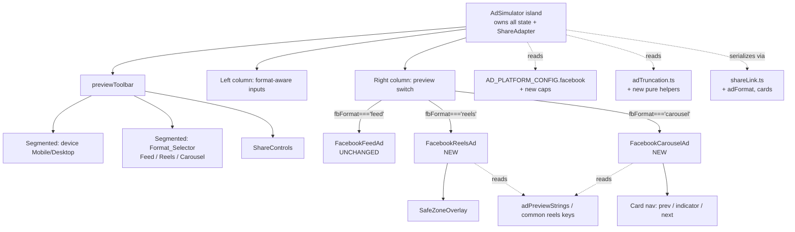

# Design Document

## Overview

This feature expands the existing Facebook ad preview tool (currently a single
Feed placement) with a **Format_Selector** offering three formats — **Feed**
(unchanged), **Reels** (full-screen vertical 9:16 with native creator chrome and
a safe-zone overlay), and **Carousel** (2–10 swipeable cards, each with its own
media, headline, and optional description, over one shared primary text). Stories
and Collection are out of scope.

The design is deliberately *additive*. It reuses every existing seam in the
`AdSimulator` island architecture rather than reworking it:

- The orchestrating `AdSimulator` island keeps owning state and the share
  adapter; it gains a Facebook-scoped `fbFormat` state and a carousel card model.
- The current `FacebookFeedAd` component is **not modified** — its inputs and
  output stay byte-for-byte identical (Req 1.4).
- Two new presentational components, `FacebookReelsAd` and
  `FacebookCarouselAd`, follow the established vertical-9:16 pattern proven by
  `InstagramAd` and `TikTokAd`, reusing `SafeZoneOverlay`, the `ui.tsx`
  primitives, and the in-memory media picker.
- All new numeric limits land in `AD_PLATFORM_CONFIG.facebook` (Req 13); all new
  truncation/clamp logic lands in `adTruncation.ts` as pure, DOM-free helpers
  (Req 13.2, 13.4) covered by fast-check property tests in the existing style.
- The share-link codec (`shareLink.ts`) gains an `adFormat` discriminator and a
  `cards` array, validated defensively so a malformed link degrades to Feed
  (Req 10.6) and never leaks across platforms (Req 10.7) or carries media
  (Req 10.5).
- New UI copy is added to the English-canonical `AdPreviewStrings` shape and the
  `IslandStrings` type (Req 11.3, 11.4); existing Facebook Reels keys
  (`common.subscribe`, `common.fullscreen`, `common.reelAudio`) are reused
  rather than duplicated (Req 2.8, 11.5).

### Research notes informing the design

- **Existing vertical-format pattern.** `InstagramAd` and `TikTokAd` already
  render a `relative overflow-hidden` frame at `aspect-ratio:9 / 16`, layer a
  `SafeZoneOverlay` (driven by `SafeZoneInsets` percentages), and place chrome in
  absolutely-positioned overlay stacks with a `drop-shadow`/scrim for legibility.
  `FacebookReelsAd` adopts this verbatim, sourcing insets from the already-present
  `AD_PLATFORM_CONFIG.facebook.reelsSafeZone` (`{ topPct:14, bottomPct:35,
  rightPct:15 }`). This satisfies Req 2 and Req 3 with no new overlay machinery.
- **Truncation is centralized and grapheme-safe.** `adTruncation.ts` already
  exposes `truncateFacebookPrimary` (the 125-char feed cutoff) and grapheme-safe
  slicing via `textTools.sliceChars`. New helpers follow the exact same
  `FieldTruncation { text, truncated }` contract, so the carousel shared primary
  *reuses* `truncateFacebookPrimary` directly (Req 7.6, 7.7) and the Reels/Carousel
  helpers inherit the proven grapheme-cluster behavior (Req 4.4, 7.8).
- **Share codec is total and defensive.** `parseShare`/`validateView` already
  coerce unknown enum values away and never throw. Extending `AdShareView` with a
  whitelisted `adFormat` literal union and a structurally-validated `cards` array
  means a malformed `adFormat` naturally collapses to "absent", which the island
  resolves to Feed (Req 10.6) — matching the existing `device`/`mode` handling.
- **CTA + display link already resolved centrally.** `resolveCta('facebook', cta)`
  and `clampDisplayLink`/`deriveDisplayLink` already exist and are reused by the
  Reels CTA overlay (Req 2.4, 2.5), so no CTA logic is re-authored.

## Architecture

### Component tree (Facebook tool)



### Key architectural decision: a Facebook-scoped `fbFormat`, not the shared `mode`

`AdSimulator` already has a `mode: 'feed' | 'reels'` state, but it is
**Instagram-specific** (the Feed/Reels placement toggle) and is serialized into
the share link as `view.mode` with a `'feed' | 'reels'` enum. Facebook needs a
*third* value, `'carousel'`, and the Facebook format selection is conceptually a
different control from Instagram's placement.

**Decision: introduce a dedicated `fbFormat: 'feed' | 'reels' | 'carousel'`
state and a dedicated `view.adFormat` share field; do not overload `mode`.**

Rationale:
- Overloading `mode` would force its enum (and the `view.mode` codec validator)
  to accept `'carousel'`, which would then be a legal — but meaningless — value
  for Instagram, weakening cross-platform isolation and the type's honesty.
- A separate `adFormat` field lets the share codec validate Facebook formats
  independently and fall back to Feed on a malformed value (Req 10.6) without
  touching Instagram's `mode` handling.
- The Reels safe-zone toggle reuses the existing `safeZone` boolean state
  (already wired for Instagram/TikTok), so no new toggle state is required
  (Req 3.1–3.5).

The `CONTROLS` map gains a `format` capability flag so only Facebook renders the
Format_Selector:

```ts
interface PlatformControls {
  device: boolean;
  mode: boolean;     // Instagram Feed/Reels
  format: boolean;   // NEW — Facebook Feed/Reels/Carousel
  safeZone: boolean;
  media: boolean;
}
// facebook: { device: true, mode: false, format: true, safeZone: false, media: true }
```

`safeZone` stays `false` in the static map; the Facebook tool shows the
safe-zone toggle **conditionally**, only while `fbFormat === 'reels'`
(Req 3.1, 3.6), computed at render time rather than from the static capability.

## Components and Interfaces

### `AdSimulator` (modified)

New state:

```ts
type FbFormat = 'feed' | 'reels' | 'carousel';

interface CarouselCard {
  headline: string;
  description: string;
  mediaUrl: string | null;
  mediaKind: 'image' | 'video';
}

const [fbFormat, setFbFormat] = useState<FbFormat>('feed');           // Req 1.2
const [cards, setCards] = useState<CarouselCard[]>([]);                // lazily seeded
const [activeCard, setActiveCard] = useState(0);                       // Req 5.2
```

Responsibilities added:
- Render the Format_Selector `Segmented` in `previewToolbar` when
  `controls.format` (Req 1.1, 1.5, 1.6).
- On the first switch to Carousel with an empty `cards` array, seed
  `cfg.facebook.carousel.minCards` empty cards and set `activeCard = 0`
  (Req 5.2). Seeding is idempotent (only when `cards.length === 0`) so switching
  away and back preserves the cards (Req 1.7).
- Provide pure card operations (`addCard`, `removeCard`, `goToCard`) that defer
  the count/active-index math to helpers in `adTruncation.ts` (below).
- Manage the object-URL lifecycle for **all** card media plus the feed/reels
  single media (Req 6.2, 6.3, 6.7) — see Data Models.
- Extend the `ShareAdapter.collect`/`apply` to (de)serialize `adFormat` and
  `cards` (Req 10).
- Render a **format-aware** left-column field set (replaces the single
  `buildFields('facebook', …)` call for Facebook):
  - **Feed**: primary, headline, description (unchanged).
  - **Reels**: primary (the caption) + the existing display-link/CTA controls +
    the safe-zone toggle.
  - **Carousel**: shared primary + a dynamic list of per-card rows (headline,
    description, per-card media picker) + add/remove buttons + a card navigator.

The right-column `switch (platform)` Facebook arm becomes a sub-switch on
`fbFormat`:

```tsx
case 'facebook':
  if (fbFormat === 'reels')
    return <FacebookReelsAd … safeZone={safeZone} toolbar={previewToolbar} />;
  if (fbFormat === 'carousel')
    return <FacebookCarouselAd … cards={cards} activeCard={activeCard}
             onPrev={…} onNext={…} toolbar={previewToolbar} />;
  return <FacebookFeedAd … toolbar={previewToolbar} />;   // unchanged path (Req 1.4)
```

### `FacebookReelsAd` (new)

```ts
interface FacebookReelsAdProps {
  s: IslandStrings;
  lang: string;
  primary: string;            // shared caption
  safeZone: boolean;          // Req 3.1–3.5
  mediaUrl: string | null;
  mediaKind?: 'image' | 'video';
  destinationUrl?: string;
  cta?: string;
  toolbar?: ComponentChildren;
}
```

Renders (mirroring `InstagramAd` Reels chrome, Req 2):
- A `relative overflow-hidden` frame at `aspect-ratio:9 / 16`, media via
  `CoverMedia` filling the frame (`object-cover`, aspect preserved, cropped —
  Req 2.6); empty-media placeholder from `ap.media.add` when no media (Req 2.7).
- Creator row using `common.handle` + `common.subscribe` (reused key, Req 2.2,
  2.8); audio-attribution `common.reelAudio` and `ap.sponsored` disclosure
  (Req 2.3); `ap.adLabel` corner disclosure.
- `SafeZoneOverlay insets={fb.reelsSafeZone} label={ap.safeZoneTag}` only when
  `safeZone` (Req 3.3, 3.4); a localized `ap.safeZoneHint` line beneath when on
  (Req 3.7).
- Caption truncated via `truncateFacebookReelsPrimary(primary)` (Req 4); the
  visible text is followed by the configured See More affordance only when
  truncated.
- A CTA overlay rendered only when `resolveCta('facebook', cta)` is non-null
  (Req 2.4, 2.5).
- A `Badge` whose tone/label come from the shared badge helper (Req 9.1, 9.2).
- A scrim (gradient/`bg-black/45` panel + `drop-shadow`) behind overlay text to
  hold ≥4.5:1 contrast over user media (Req 12.5, 12.6).

### `FacebookCarouselAd` (new)

```ts
interface FacebookCarouselAdProps {
  s: IslandStrings;
  primary: string;                 // shared, above the card area (Req 6.4)
  cards: CarouselCard[];           // 2–10 (Req 5.1, 6.1)
  activeCard: number;              // index of the displayed card
  device: 'mobile' | 'desktop';
  destinationUrl?: string;
  cta?: string;
  onPrev: () => void;              // Req 8.1
  onNext: () => void;              // Req 8.1
  onArrowKey: (dir: -1 | 1) => void; // Req 12.1 (Left/Right)
  toolbar?: ComponentChildren;
}
```

Renders:
- The shared primary once above the card strip, truncated via
  `truncateFacebookPrimary` (Req 6.4, 7.6, 7.7).
- The active card: media (or `ap.media.add` placeholder, Req 6.6); headline
  clamped via `clampCarouselHeadline`; description region rendered only when
  non-empty, clamped via `clampCarouselDescription` (Req 6.1, 6.5, 7.2–7.5).
- Navigation: a previous button (`disabled` at `activeCard === 0`, Req 8.3), a
  next button (`disabled` at `activeCard === cards.length - 1`, Req 8.4), and a
  position indicator `interp(ap.carouselPosition, { current: activeCard+1, total:
  cards.length })` rendering "current / total" (Req 8.6). Buttons carry
  `aria-label`s from `ap.carouselPrev` / `ap.carouselNext` (Req 8.5, 12.2). The
  frame container handles `ArrowLeft`/`ArrowRight` `keydown` → `onArrowKey`
  (Req 12.1). `disabled` buttons are inherently non-interactive and do not fire
  on Enter/Space (Req 8.7).
- A `Badge` from the shared badge helper over the carousel field set (Req 9.3,
  9.4).

### `adTruncation.ts` (extended) — new pure helpers

```ts
// Reels caption: show up to the configured cutoff, then the feed See More label.
// Mirrors truncateFacebookPrimary but reads the Reels cutoff.
export function truncateFacebookReelsPrimary(text: string): FieldTruncation;

// Carousel card fields: hard-clamp to the cap with NO affordance appended.
export function clampCarouselHeadline(text: string): FieldTruncation;
export function clampCarouselDescription(text: string): FieldTruncation;

// Card-set reducers (pure; operate on counts/indices, not React state).
export interface CardCountResult { count: number; activeIndex: number; changed: boolean; atLimit: boolean; }
export function addCard(count: number, activeIndex: number, min: number, max: number): CardCountResult;     // Req 5.3, 5.4
export function removeCard(count: number, removeIndex: number, activeIndex: number, min: number): CardCountResult; // Req 5.5–5.8
export function stepCard(activeIndex: number, dir: -1 | 1, count: number): number;                          // Req 8.1, 8.3, 8.4

// Per-format status badge state (label key + tone), pure over field presence/truncation.
export type BadgeState = { toneKind: 'neutral' | 'safe' | 'warn'; label: 'fits' | 'truncated' };
export function facebookBadgeState(anyInput: boolean, anyTruncated: boolean): BadgeState; // Req 9.1–9.5, 9.7
```

`clampCarouselHeadline`/`clampCarouselDescription` are thin wrappers over a
shared internal `clampField(text, cap)` that returns
`{ text: sliceChars(text, 0, cap), truncated: charCount(text) > cap }` — no See
More label, grapheme-safe (Req 7.2–7.5, 7.8). `addCard`/`removeCard`/`stepCard`
contain the count-bound and active-index rules so no component holds that logic
(Req 13.2). All helpers are pure and DOM-free (Req 13.4).

### `AD_PLATFORM_CONFIG.facebook` (extended)

```ts
facebook: {
  primaryTruncateChars: 125,        // existing — reused for carousel shared primary
  headlineSafeMin: 27,
  headlineSafeMax: 40,
  descriptionMax: 30,
  seeMoreLabel: '… See More',       // existing — reused by Reels caption
  reelsSafeZone: { topPct: 14, bottomPct: 35, rightPct: 15 },  // existing
  // ── NEW ──
  reelsPrimaryTruncateChars: 55,    // Req 4.1 — Reels caption cutoff (graphemes)
  carousel: {
    minCards: 2,                    // Req 5.1
    maxCards: 10,                   // Req 5.1
    cardHeadlineMax: 40,            // Req 7.1
    cardDescriptionMax: 20,         // Req 7.1
  },
}
```

The `FacebookPlatformConfig` interface gains the matching fields so a component
referencing an absent limit fails at type-check (Req 13.5). Exact published 2026
values are confirmed at implementation time; the structure and sourcing are
fixed here.

### `linkBehavior.ts`

No structural change required: Facebook already declares `showsDisplayLink`,
`displayLinkMaxChars: 30`, `hasCtaButton`, and `ctaLabels: META_CTA_LABELS`.
Reels and Carousel reuse the same `resolveCta('facebook', cta)`,
`deriveDisplayLink`, and `clampDisplayLink` paths the Feed preview already uses.

### `shareLink.ts` (extended)

```ts
export interface AdShareCard {
  headline?: string;     // present only when non-empty (Req 10.2)
  description?: string;  // present only when non-empty (Req 10.2)
}

export interface AdShareView {
  device?: 'mobile' | 'desktop';
  mode?: 'feed' | 'reels';
  adFormat?: 'feed' | 'reels' | 'carousel';   // NEW (Req 10.1)
  cards?: AdShareCard[];                        // NEW (Req 10.2, 10.4)
  safeZone?: boolean;
  destinationUrl?: string;
  cta?: string;
  finalUrl?: string;
  paths?: string[];
}
```

`validateView` accepts `adFormat` only when it is exactly one of the three
literals (anything else is dropped → resolves to Feed, Req 10.6) and accepts
`cards` only when it is an array of plain objects, coercing each entry to
`{ headline?, description? }` keeping non-empty strings (Req 10.2). `pruneEmptyFields`
emits one `cards` entry per card in display order (preserving count, Req 10.4),
dropping empty headline/description within each entry, and drops the whole
`cards` key when not carousel. Media has no representable field, so it can never
be serialized (Req 10.5). `apply` remains gated on `state.platform === platform`
(Req 10.7).

### i18n additions (`IslandStrings` / `AdPreviewStrings`, English canonical)

New keys added to `AdPreviewStrings` (canonical values in `adPreviewStrings.ts`,
declared in `types.ts` so omissions are compile-time errors — Req 11.3, 11.4):

| Key | English canonical | Requirement |
|---|---|---|
| `formatAria` | "Choose ad format" | 1.6, 12.2 |
| `formatFeed` | "Feed" | 1.5 |
| `formatReels` | "Reels" | 1.5 |
| `formatCarousel` | "Carousel" | 1.5 |
| `carouselAddCard` | "Add card" | 5.3 |
| `carouselRemoveCard` | "Remove card" | 5.5 |
| `carouselMaxReached` | "Maximum of {max} cards reached" | 5.4 |
| `carouselMinReached` | "Minimum of {min} cards required" | 5.6 |
| `carouselPrev` | "Previous card" | 8.5 |
| `carouselNext` | "Next card" | 8.5 |
| `carouselPosition` | "{current} / {total}" | 8.6 |
| `cardN` | "Card {n}" | 6.1 |
| `cardHeadline` | "Card headline" | 6.1 |
| `cardDescription` | "Card description" | 6.1 |
| `placeholders.cardHeadline` | "Your card headline" | 6.1 |
| `placeholders.cardDescription` | "Add a short description" | 6.1 |

Reused existing keys (no duplicates, Req 2.8, 11.5): `common.subscribe`,
`common.fullscreen`, `common.reelAudio`, `ap.sponsored`, `ap.adLabel`,
`ap.safeZoneTag`, `ap.safeZoneHint`, `ap.safeZoneLabel`, `ap.badgeFits`,
`ap.badgeTruncated`, `ap.media.*`, `ap.feed`, `ap.reels`. The English-fallback
getter `adPreviewStrings(s)` already returns the canonical object when a locale
omits `adPreviews`, so empty/missing locale values fall back to English
(Req 11.2).

## Data Models

### Carousel card model and object-URL lifecycle

```ts
interface CarouselCard {
  headline: string;
  description: string;
  mediaUrl: string | null;   // in-memory object URL, never persisted/serialized
  mediaKind: 'image' | 'video';
}
```

Lifecycle rules (Req 6.2, 6.3, 6.7):
- Picking media for card *i* revokes that card's previous `mediaUrl` (if any)
  before assigning the new one — only that card's URL changes.
- Removing a card revokes its `mediaUrl`.
- On unmount, every card's `mediaUrl` plus the feed/reels single `mediaUrl` is
  revoked. A `cardsRef` mirrors the live `cards` array (the same pattern as the
  existing `mediaUrlRef`) so the unmount cleanup revokes the latest URLs without
  resubscribing the effect.
- No `mediaUrl` is ever read by `collect()`, so it cannot enter a share link.

### Per-format value preservation (Req 1.7)

State is **never reset on format switch**. The shared `primary` lives in the
existing `values.primary` and is rendered by all three formats. Feed-only fields
(`values.headline1`, `values.description`) and the carousel `cards` array coexist
in independent state slots, so switching Feed → Reels → Feed restores Feed's
headline/description untouched, and Feed → Carousel → Feed preserves both the
Feed fields and the carousel cards.

### Card-set reducer semantics (Req 5.3–5.8, 8.1–8.4)

| Operation | Precondition | Result |
|---|---|---|
| `addCard` | `count < max` | `count+1`, append, `activeIndex = count` (new last), `changed:true` |
| `addCard` | `count === max` | unchanged, `atLimit:true` (drives `carouselMaxReached`) |
| `removeCard` | `count > min` | remove `removeIndex`, `count-1`; if removed active & not last → active stays at same index (the following card shifts into it); if removed active & last → `active = count-2` (preceding) |
| `removeCard` | `count === min` | unchanged, `atLimit:true` (drives `carouselMinReached`) |
| `stepCard` | `0 < active`, dir −1 | `active-1` |
| `stepCard` | `active < count-1`, dir +1 | `active+1` |
| `stepCard` | at bound | unchanged (disabled control) |

Invariant: after any operation, `0 <= activeIndex < count` and
`min <= count <= max`.

## Correctness Properties

*A property is a characteristic or behavior that should hold true across all
valid executions of a system — essentially, a formal statement about what the
system should do. Properties serve as the bridge between human-readable
specifications and machine-verifiable correctness guarantees.*

The new logic is concentrated in pure, DOM-free helpers (`adTruncation.ts`) and
the pure share codec (`shareLink.ts`), which is exactly where property-based
testing pays off. Properties are written in the existing fast-check style
(`adTruncation.linkDisplay.test.ts`), with unicode-heavy generators
(emoji/ZWJ/combining/CJK/astral) to prove grapheme safety.

### Property 1: Reels primary truncation

*For any* string, `truncateFacebookReelsPrimary` returns the full text with
`truncated:false` when its grapheme-cluster count is ≤ the configured Reels
cutoff, and otherwise returns exactly the first *cutoff* grapheme clusters
followed by the configured See More label with `truncated:true`; the sliced
prefix is always a whole-grapheme prefix of the input (no cluster split) and the
empty string yields `{ text:'', truncated:false }`.

**Validates: Requirements 4.2, 4.3, 4.4, 4.5**

### Property 2: Carousel card-field clamp

*For any* string and *for each* carousel card-field helper
(`clampCarouselHeadline`, `clampCarouselDescription`), the output text has a
grapheme-cluster count ≤ the field's configured cap, never appends a See More
affordance, equals the input unchanged when within the cap (`truncated:false`),
and is always a whole-grapheme prefix of the input when clamped (`truncated:true`).

**Validates: Requirements 7.2, 7.3, 7.4, 7.5, 7.8**

### Property 3: Carousel shared-primary truncation

*For any* string, the carousel shared primary truncates identically to the
Facebook feed primary — full text when ≤ the feed cutoff, else the first *cutoff*
grapheme clusters plus the configured See More label — reusing
`truncateFacebookPrimary` so feed and carousel can never diverge.

**Validates: Requirements 7.6, 7.7**

### Property 4: Card-count reducer stays within bounds

*For any* starting card count in `[min, max]`, any active index in
`[0, count-1]`, and any sequence of `addCard`/`removeCard` operations, the
resulting count is always within `[min, max]`; `addCard` increases the count by
exactly 1 and selects the newly appended last card when below `max` and leaves
the count unchanged at `max`; `removeCard` decreases the count by exactly 1 when
above `min` and leaves it unchanged at `min`.

**Validates: Requirements 5.3, 5.4, 5.5, 5.6**

### Property 5: Active card index is always valid and transitions per spec

*For any* card count in `[min, max]`, active index in `[0, count-1]`, and any
sequence of `removeCard` and `stepCard` operations, the active index always
remains within `[0, count-1]`; removing the active non-last card keeps the index
pointing at the card that followed it; removing the active last card moves the
index to the preceding card; `stepCard` moves exactly one position inward and is
a no-op at either bound.

**Validates: Requirements 5.7, 5.8, 8.1, 8.3, 8.4**

### Property 6: Per-format status badge state

*For any* combination of field-presence and truncation flags for a Facebook
format, `facebookBadgeState` returns neutral tone + "Fits" when no field has
input, warn tone + "Truncated" when any field is clamped or truncated, and safe
tone + "Fits" otherwise; in every case the returned label is non-empty (state is
conveyed by text and tone, never tone alone).

**Validates: Requirements 9.1, 9.2, 9.3, 9.4, 9.5, 9.7**

### Property 7: Per-format value preservation across switches

*For any* sequence of field edits and format switches, the value presented for a
given format equals the most recent value entered for that format, and the
shared primary text is identical across all three formats at every step (no
switch clears or cross-contaminates a format's fields).

**Validates: Requirements 1.7**

### Property 8: Facebook share-link round-trip

*For any* Facebook ad state (active format, field values including empty/
whitespace-only ones, and a carousel card array of 2–10 cards with arbitrary
headline/description content), serializing with `collect`/`pruneEmptyFields`,
encoding, decoding with `parseShare`, and applying restores: the active format;
every non-empty, non-whitespace field value (with empty/whitespace fields left
empty); and — when carousel — the same number of cards in the same display order
populated from their serialized values. Media is always absent after restore.

**Validates: Requirements 10.1, 10.2, 10.3, 10.4, 10.5**

### Property 9: Malformed or absent format falls back to Feed

*For any* decoded share view whose `adFormat` is missing, empty, or not one of
`feed`/`reels`/`carousel`, the resolved active format is Feed while the remaining
valid serialized field values are still restored.

**Validates: Requirements 1.8, 10.6**

### Property 10: Cross-platform share isolation

*For any* share state encoding a platform other than `facebook`, applying it to
the Facebook tool leaves the Facebook state at its defaults (Feed format, empty
fields, no cards), so foreign-platform links never mutate the Facebook tool.

**Validates: Requirements 10.7**

### Property 11: Helper determinism and purity

*For any* input, each new truncation/clamp/reducer helper returns a value equal
to a second call with the same input (referential transparency) and produces no
observable side effects, confirming the helpers are safe to test without a DOM.

**Validates: Requirements 13.4**

## Error Handling

- **Malformed share tokens.** Delegated to the existing total `parseShare`,
  which never throws and returns `null` on damaged/truncated/future-version
  tokens; the island then keeps its defaults (Feed, empty fields). New `adFormat`
  and `cards` validation follows the same drop-and-coerce discipline (Req 10.6).
- **Out-of-range card operations.** `addCard`/`removeCard` clamp at `max`/`min`
  and report `atLimit`, which drives the localized `carouselMaxReached` /
  `carouselMinReached` notice (Req 5.4, 5.6). Disabled nav buttons plus
  `stepCard` no-ops at bounds prevent index overflow (Req 8.3, 8.4).
- **Unparseable destination URL.** Reused `deriveDisplayLink` returns the trimmed
  input rather than throwing, so the Reels/Carousel preview still renders.
- **Missing media.** Each preview renders the localized empty-media placeholder
  rather than a broken ``/`<video>` (Req 2.7, 6.6).
- **Missing config limit.** Referencing an undefined `AD_PLATFORM_CONFIG.facebook`
  field is a compile-time TypeScript error (Req 13.5); no runtime fallback
  literals exist in components (Req 13.1).
- **Object-URL leaks.** Replace/remove/unmount paths revoke URLs via the
  `cardsRef` mirror so no `blob:` URL outlives its card (Req 6.7).

## Testing Strategy

Property-based testing **is appropriate** here: the new truncation, clamping,
card-set reducer, badge, and share-codec logic are pure functions with large
input spaces and clear universal properties. PBT does **not** apply to the
preview components' layout, chrome, accessibility attributes, responsive behavior,
or contrast — those are covered by example/render and visual checks.

### Property-based tests (fast-check, ≥100 iterations each)

Implemented in `adTruncation.facebookFormats.test.ts` and
`shareLink.facebookFormats.test.ts`, reusing the independent `Intl.Segmenter`
grapheme oracle and unicode-heavy generators from the existing link-display
suite. Each test is tagged with a comment referencing its design property:

`// Feature: facebook-ad-formats, Property {n}: {property text}`

- Properties 1–3 → Reels/Carousel truncation + clamp helpers.
- Properties 4–5 → card-count and active-index reducers over generated operation
  sequences.
- Property 6 → `facebookBadgeState` over the flag space.
- Property 7 → a model of the per-format value store over generated edit/switch
  sequences.
- Properties 8–10 → `collect → serialize → parseShare → apply` round-trip,
  malformed-format fallback, and cross-platform isolation, generating arbitrary
  Facebook states (including 2–10 carousel cards).
- Property 11 → determinism wrapper over every new helper.

All caps, cutoffs, bounds, and labels in tests are read from
`AD_PLATFORM_CONFIG.facebook` / `LINK_BEHAVIOR.facebook` so tests stay in
lock-step with the single source of truth.

### Unit / example tests

- Format_Selector renders exactly Feed/Reels/Carousel in order with accessible
  name + selected state (Req 1.1, 1.6); default is Feed on mount (Req 1.2);
  selecting a format mounts exactly one preview (Req 1.3); Feed output equals the
  pre-feature snapshot (Req 1.4).
- Reels chrome: 9:16 frame, creator/Subscribe, audio/Sponsored, CTA shown/omitted
  by `resolveCta`, empty-media placeholder, safe-zone overlay on/off + hint,
  toggle hidden when not Reels (Req 2.1–2.7, 3.1–3.7).
- Carousel: per-card media/headline/optional-description rendering, shared primary
  above the strip, empty-description omission, nav disabled states, position
  indicator, accessible nav names, Enter/Space/Arrow activation (Req 6.1, 6.4–6.6,
  8.2, 8.5–8.7, 12.1, 12.2).
- Object-URL lifecycle: mock `URL.createObjectURL`/`revokeObjectURL`; assert prior
  URL revoked on per-card replace, on remove, and on unmount (Req 6.2, 6.7).
- i18n: a locale missing a new key resolves to the English canonical value, never
  an empty string or raw key (Req 11.2); a parity/no-duplicate-key check confirms
  Reels reuses existing keys (Req 2.8, 11.5).

### Accessibility & responsive checks

- Keyboard reachability/activation and arrow-key carousel navigation; visible
  focus indicator (reusing the existing `focus-visible:outline-*` tokens) at
  ≥3:1 contrast (Req 12.1–12.3).
- Manual/visual verification of no clipping or horizontal scroll at 320–767px and
  ≥1024px, and ≥4.5:1 body-text contrast over media via the scrim overlay
  (Req 12.4–12.6). Full WCAG conformance requires manual assistive-technology
  testing beyond automated checks.
