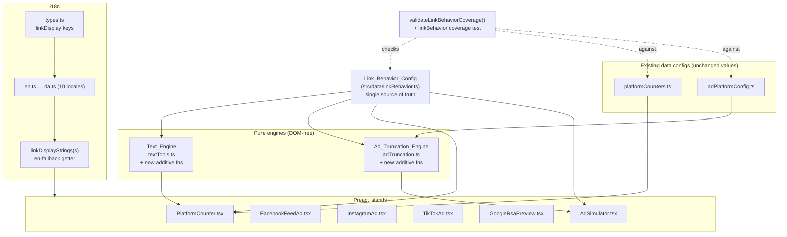

# Design Document

## Overview

This feature teaches both PostTruncate silos — the platform character counters and the ad-preview
simulators — to represent link-display behavior accurately, replacing the single hard-coded "every
link is 23 characters" assumption that is only correct for X/Twitter.

The design is governed by one overriding constraint from the requirements (Requirement 13) and from
the user: **nothing that works today may break, and the rollout must be possible one platform at a
time.** Every design decision below is therefore *additive and backward-compatible by construction*:

- A new `Link_Behavior_Config` module becomes the single source of truth (Requirement 1, 15). It is a
  pure data module with no dependencies on the engines, so adding it cannot change existing behavior.
- The `Text_Engine` (`src/lib/textTools.ts`) and `Ad_Truncation_Engine` (`src/lib/adTruncation.ts`)
  gain **new exported functions only**. The existing exports — `detectUrls`, `weightedLength`,
  `charCount`, `byteCounts`, `truncateFacebookPrimary`, `truncateTikTokPrimary`, `clampGoogleField`,
  `instagramReelsFit`, `googleHeadlineFits` — keep their signatures and their results unchanged
  (Requirements 3.4, 13.1, 13.2).
- The islands consume the new behavior through the same en-fallback i18n pattern already used for
  `adPreviews`/`imageUpload`, and only render link-display indications when a URL is actually present
  (Requirements 8.2, 8.3).
- A validation check fails the test suite if any counter or ad platform is missing a config record
  (Requirement 1.6).

Because the rollout is incremental, the design separates "the config knows about a platform" from
"a given island reads the config." A platform can be added to `Link_Behavior_Config` and verified by
tests before any island is wired to surface it, and each island can opt in independently.

### Why a single source of truth

Today three places encode link facts that can drift: `LIMITS.URL_WEIGHT` in `textTools.ts`, the
truncation thresholds in `adPlatformConfig.ts`, and the prose in `tools.ts`/`adPreviews.ts`. The new
config centralizes the *link-display* facts (the model, the bio allowance, the fixed weight, the ad
display-link/path/CTA attributes, and a `lastReviewed` date) so a platform change is a single edit
(Requirements 15.2, 15.3). Existing threshold constants in `AD_PLATFORM_CONFIG` and field limits in
`PLATFORM_COUNTERS` are *preserved as-is*; the new config references or complements them rather than
replacing them (Requirement 13.4).

## Architecture



### Data flow

1. **Counter pages.** `PlatformCounter` already receives a `platform` id and renders fields from
   `PLATFORM_COUNTERS`. It will additionally read the platform's `Link_Behavior_Config` record, run
   the engine's new per-platform link-counting function over the body field, and — only when a URL is
   detected — render a localized indication describing the platform's `Link_Display_Model`.
2. **Ad simulators.** `AdSimulator` builds field sets and mounts the per-platform preview island. It
   will gain optional `displayLink`/`displayPath`/`cta` fields for platforms whose config declares
   them, pass them through the `Ad_Truncation_Engine`'s new clamping functions, and forward clamped
   values to the preview islands.
3. **Engines stay pure.** Both engines remain DOM-free. They import the config (a plain data module)
   and expose new functions; islands stay thin renderers.

### Incremental rollout contract

The config is keyed by a stable platform id shared across silos. A platform's presence in the config
is validated independently of whether any island reads it, so the implementation plan can:

1. Add `Link_Behavior_Config` + its validation test (no UI change, no behavior change).
2. Add the engine's additive functions + their tests (existing tests still pass).
3. Wire one island/platform at a time, each behind "only when a URL is detected," so an un-wired
   platform renders exactly as it does today.

## Components and Interfaces

### 1. Link_Behavior_Config (`src/data/linkBehavior.ts`) — new module

A pure data module. No imports from the engines (one-way dependency), so it cannot regress existing
behavior.

```typescript
/** The four ways a platform renders a link in an organic post body. */
export type LinkDisplayModel =
  | 'counted-shortened' // X/Twitter t.co — fixed weight
  | 'plain-text'        // Instagram, TikTok, YouTube Shorts — literal non-clickable text
  | 'preview-card'      // Facebook, LinkedIn, Threads, Discord, WhatsApp, Bluesky — OG card
  | 'clickable-inline'; // Reddit, Pinterest — clickable inline, no mandatory card

/** How a platform counts the characters of a detected link. */
export type LinkCountMode =
  | 'fixed-weight' // each URL counts as `fixedLinkWeight` (X/Twitter)
  | 'per-char'     // each character of the URL counts under standard weighting
  | 'per-byte';    // each UTF-8 byte counts (Bluesky)

/** Organic-post link behavior for one counter platform. */
export interface OrganicLinkBehavior {
  model: LinkDisplayModel;
  countMode: LinkCountMode;
  /** Present only when countMode === 'fixed-weight'. Mirrors LIMITS.URL_WEIGHT for X. */
  fixedLinkWeight?: number;
  /** True when the preview card is built from the FIRST detected URL only. */
  cardFromFirstUrlOnly?: boolean;
  /** True when link offsets must be computed as UTF-8 byte ranges (Bluesky facets). */
  byteIndexedFacets?: boolean;
  /** Max clickable bio links; omitted when the platform sets no documented limit. */
  bioLinkAllowance?: number;
}

/** Ad link-display behavior for one ad-preview platform. */
export interface AdLinkBehavior {
  /** Whether a Display_Link region is shown beneath the headline. */
  showsDisplayLink: boolean;
  /**
   * Character cap for the Display_Link. 0 disables the Display_Link entirely
   * (Requirement 12.2). Omitted when the platform shows no display link.
   */
  displayLinkMaxChars?: number;
  /** Whether the platform supports Display_Path segments (Google RSA). */
  supportsDisplayPath: boolean;
  /** Max number of path segments (Google RSA = 2). */
  maxPathSegments?: number;
  /** Per-segment character cap (Google RSA = 15). */
  pathSegmentMaxChars?: number;
  /** Whether a CTA_Button carries the click. */
  hasCtaButton: boolean;
  /** Supported CTA labels (English source; localized at render where needed). */
  ctaLabels?: string[];
  /** True when in-feed ad captions carry no clickable link (TikTok). */
  captionLinkClickable: boolean;
}

/** One platform's complete link-display record. */
export interface LinkBehaviorRecord {
  /** Stable platform id, shared across both silos. */
  platform: string;
  /** Organic-post behavior. Present for every counter platform. */
  organic?: OrganicLinkBehavior;
  /** Ad behavior. Present for every ad-preview platform. */
  ad?: AdLinkBehavior;
  /** ISO YYYY-MM-DD date the rule was last reviewed (Requirement 15.1). */
  lastReviewed: string;
  /** Optional source note/URL for verifiability (Requirement 15). */
  source?: string;
}

export const LINK_BEHAVIOR: Record<string, LinkBehaviorRecord> = { /* … */ };
```

The record map covers every platform named in the requirements glossary:

| Platform id | Organic model | countMode | bioLinkAllowance | Ad record |
|---|---|---|---|---|
| `twitter` | counted-shortened | fixed-weight (23) | — | — |
| `linkedin` | preview-card | per-char | — | — |
| `instagram` | plain-text | per-char | 5 | yes (Meta) |
| `facebook` | preview-card | per-char | — | yes (Meta) |
| `tiktok` | plain-text | per-char | 1 | yes |
| `threads` | preview-card | per-char | 5 | — |
| `youtube` | plain-text | per-char | — | — |
| `pinterest` | clickable-inline | per-char | — | — |
| `reddit` | clickable-inline | per-char | — | — |
| `bluesky` | preview-card | per-byte (byteIndexedFacets) | — | — |
| `discord` | preview-card | per-char | — | — |
| `whatsapp` | preview-card | per-char | — | — |
| `google` (ad) | — | — | — | yes (displayPath) |

The `fixedLinkWeight` for `twitter` is set to `LIMITS.URL_WEIGHT` (re-exported from the engine so the
two never diverge), preserving the existing 23-character rule (Requirements 1.4, 3.1).

#### Coverage validation (`validateLinkBehaviorCoverage`)

```typescript
export interface CoverageResult {
  ok: boolean;
  missingOrganic: string[]; // counter platforms with no organic record
  missingAd: string[];      // ad platforms with no ad record
}

/**
 * Verify every Platform_Counter and Ad_Preview_Simulator platform has a matching
 * Link_Behavior_Config record. Pure: takes the platform id lists as arguments so
 * it is unit-testable and can be called from a build/test guard (Requirement 1.6).
 */
export function validateLinkBehaviorCoverage(
  counterPlatforms: string[],
  adPlatforms: string[],
): CoverageResult;
```

The canonical platform-id lists come from `PLATFORM_COUNTERS` keys plus the five preview-island
counters (`twitter`, `linkedin`, `instagram`, `facebook`, `threads`) and `AD_PLATFORM_CONFIG` keys.
A test (`linkBehavior.test.ts`) calls this with the real lists and fails when a platform is missing,
satisfying Requirement 1.6 by reporting the offending platform id.

### 2. Text_Engine additive functions (`src/lib/textTools.ts`)

All existing exports are untouched. New exports:

```typescript
/** Look up a platform's organic link behavior; undefined if not configured. */
export function organicLinkBehavior(platform: string): OrganicLinkBehavior | undefined;

/**
 * Weighted/standard length for a given platform's link rules. For
 * 'fixed-weight' platforms this delegates to the existing weightedLength (X/
 * Twitter parity). For 'per-char' it uses standard grapheme/weight counting
 * with NO fixed link collapse. For 'per-byte' it returns the UTF-8 byte length.
 */
export function platformLength(text: string, platform: string): number;

/** A Bluesky external-link facet with UTF-8 byte offsets. */
export interface LinkFacet {
  url: string;
  byteStart: number;
  byteEnd: number;
}

/**
 * Compute byte-indexed link facets for Bluesky. Reuses detectUrls (code-unit
 * offsets) and converts each to UTF-8 byte offsets via TextEncoder, preserving
 * the invariant 0 <= byteStart <= byteEnd <= utf8 length and the round-trip
 * that the delimited UTF-8 slice equals the detected URL text.
 */
export function blueskyLinkFacets(text: string): LinkFacet[];

/** Convenience: total UTF-8 byte length used for the Bluesky 300 limit. */
export function utf8ByteLength(text: string): number; // === byteCounts(text).utf8
```

`platformLength` is the per-platform counting entry point (Requirements 4.2, 5.3, 6.1, 6.5, 7.2). It
does **not** replace `weightedLength`; X/Twitter and any other `fixed-weight` platform get identical
results to today because that branch calls `weightedLength` directly.

`blueskyLinkFacets` is the byte-offset computation (Requirements 6.2–6.4). It maps each `UrlMatch`
(which carries code-unit `start`/`end`) to byte offsets by encoding the prefix substrings, so it
never re-implements URL detection and never mutates `detectUrls`.

### 3. Ad_Truncation_Engine additive functions (`src/lib/adTruncation.ts`)

All existing exports are untouched. New exports:

```typescript
/** Clamp a Display_Link to the platform cap, grapheme-safe. */
export function clampDisplayLink(text: string, platform: string): FieldTruncation;

/** Derive shown link text from a Destination_URL when no Display_Link given. */
export function deriveDisplayLink(destinationUrl: string): string; // domain only

/**
 * Clamp Google RSA Display_Path: at most maxPathSegments, each clamped to
 * pathSegmentMaxChars (grapheme-safe), empty segments dropped (Requirement 12.4).
 */
export function clampDisplayPath(segments: string[], platform: string): string[];

/** Build the green display URL: domain + clamped non-empty path segments. */
export function buildDisplayUrl(destinationUrl: string, segments: string[], platform: string): string;

/** Pick a CTA label, defaulting to the platform's first supported label. */
export function resolveCta(platform: string, requested?: string): string | null;
```

All clamping uses the existing `sliceChars` (grapheme-safe) so emoji/combining marks never split
(Requirement 12.3). When `displayLinkMaxChars === 0`, `clampDisplayLink` returns `{ text: '',
truncated: true }` and the island treats the display link as disabled (Requirement 12.2).

### 4. Island changes

**PlatformCounter.tsx** (Requirements 4, 5, 7, 8): after computing the existing per-field counts, it
looks up `organicLinkBehavior(platform)`. For the body field it runs `detectUrls` on the text; only
when at least one URL is found does it render a localized indication chosen by `model`:

- `plain-text` → "Links here are not clickable…" + optional bio-link allowance line.
- `preview-card` → "This link generates a preview card" (+ identifies the first URL when
  `cardFromFirstUrlOnly`).
- `clickable-inline` → "This link stays clickable inline" (+ bio allowance where set).
- `counted-shortened` → existing X behavior (counter already correct); indication optional.

The character meter for `per-char`/`per-byte` platforms uses `platformLength` instead of the bare
`charCount` where the platform's documented limit is measured that way (Bluesky uses bytes).
When the body has no URL, the component renders exactly as today (Requirement 8.4).

**AdSimulator.tsx + FacebookFeedAd / InstagramAd / GoogleRsaPreview / TikTokAd** (Requirements 9–12):
`AdSimulator` reads the platform's `ad` record and conditionally adds `displayLink` / `displayPath` /
CTA controls. Clamped values flow to the preview islands:

- Facebook/Instagram: render a `Display_Link` region distinct from the destination, using the
  provided link or `deriveDisplayLink(domain)`, plus a `CTA_Button` from `ctaLabels`. Existing
  `truncateFacebookPrimary` behavior is unchanged (Requirement 9.5).
- Google RSA: build the display URL with `buildDisplayUrl`; existing headline/description caps and
  `googleHeadlineFits` are unchanged (Requirement 10.5).
- TikTok: when `detectUrls`/`@`/`#` appears in the caption, show the "no clickable link" indication
  and render the CTA button; existing `truncateTikTokPrimary` is unchanged (Requirement 11.3).

### 5. i18n (`src/i18n/types.ts`, all 10 locales, resolver)

A new `linkDisplay` sub-object is added to `IslandStrings` and declared in `types.ts` so a missing key
in any locale is a TypeScript error (Requirement 14.2) and the parity script (`check-i18n.mjs`) stays
green only when all 10 locales carry the exact key paths (Requirement 14.5). A resolver
`linkDisplayStrings(s)` mirrors `adPreviewStrings`, returning the locale value and falling back to the
canonical English block; when even the English value is absent it returns the key identifier rather
than empty content (Requirements 14.3, 14.4). All user-visible link strings are resolved through i18n
(Requirements 4.4, 5.4, 14.1).

## Data Models

### LinkBehaviorRecord (organic + ad)

The authoritative shape is defined in *Components and Interfaces §1*. Notes on modeling choices:

- **`organic` and `ad` are independent optionals.** A platform can be a counter only (`youtube`), an
  ad platform only (`google`), or both (`facebook`, `instagram`, `tiktok`). This matches the two
  silos and lets the coverage check validate each dimension separately (Requirement 1.1, 1.2).
- **`fixedLinkWeight` is conditional on `countMode === 'fixed-weight'`** (Requirement 1.4). Only
  `twitter` carries it, sourced from `LIMITS.URL_WEIGHT` to guarantee parity with the existing engine
  (Requirement 3.1).
- **`bioLinkAllowance` is a non-negative integer**, omitted when undocumented (Requirement 1.3, 4.3,
  7.3).
- **`displayLinkMaxChars: 0`** is the explicit "disabled display link" signal (Requirement 12.2),
  distinct from an omitted cap (no clamping needed).
- **`lastReviewed`** is required on every record (Requirement 15.1); `source` is optional prose/URL
  for verifiability.

### LinkFacet (Bluesky)

```typescript
interface LinkFacet { url: string; byteStart: number; byteEnd: number; }
```

`byteStart`/`byteEnd` are UTF-8 byte offsets into the post text. The model guarantees, for all
inputs, `0 <= byteStart <= byteEnd <= utf8ByteLength(text)` and that the delimited UTF-8 slice decodes
back to `url` (Requirements 6.3, 6.4).

### Relationship to existing configs (preserved)

- `AD_PLATFORM_CONFIG` keeps every threshold (`primaryTruncateChars`, `headlineSafeMax`,
  `descriptionMax`, safe zones, etc.). `Link_Behavior_Config` adds only link-display attributes
  (Requirement 13.4).
- `PLATFORM_COUNTERS` keeps every field/limit. The counter island reads link behavior *in addition*
  to the existing field config (Requirement 13.4).

## Correctness Properties

*A property is a characteristic or behavior that should hold true across all valid executions of a
system — essentially, a formal statement about what the system should do. Properties serve as the
bridge between human-readable specifications and machine-verifiable correctness guarantees.*

These properties were derived from the prework analysis and consolidated to remove redundancy (e.g.
the per-char counting criteria and the indication-selection criteria were each merged into a single
comprehensive property). Property-based testing applies here because the engines are pure functions
over a large input space (arbitrary post text, URLs, emoji, multi-byte characters, path segments).

### Property 1: Config coverage and shape

*For all* platform ids in the canonical counter list, the config has an `organic` record whose
`model` is one of the four `LinkDisplayModel` values and whose `countMode` is a valid
`LinkCountMode`; *for all* ad platform ids, the config has an `ad` record; *for all* records, if
`bioLinkAllowance` is present it is a non-negative integer, and if `countMode === 'fixed-weight'`
then `fixedLinkWeight` is a positive number. A missing record makes `validateLinkBehaviorCoverage`
report the offending platform.

**Validates: Requirements 1.1, 1.2, 1.3, 1.4, 1.6**

### Property 2: Counted-shortened fixed-weight counting (X/Twitter preserved)

*For all* text inputs, `weightedLength(text)` equals the standard plain-text weight of the non-URL
spans plus `LIMITS.URL_WEIGHT` once per detected URL, and `platformLength(text, 'twitter')` equals
`weightedLength(text)`. This preserves the existing engine result exactly.

**Validates: Requirements 3.1, 3.3, 13.1**

### Property 3: Per-character counting for non-shortened platforms

*For all* text inputs and *for all* platforms whose `countMode === 'per-char'` (plain-text,
preview-card, clickable-inline), `platformLength(text, platform)` equals the platform's standard
per-character/grapheme count with **no** fixed-weight URL collapse — i.e. a detected URL contributes
each of its characters, not a flat 23.

**Validates: Requirements 4.2, 5.3, 7.2**

### Property 4: Bluesky byte-length counting

*For all* text inputs, `platformLength(text, 'bluesky')` equals `byteCounts(text).utf8` (the UTF-8
byte length used for the 300 limit), counting every character of any link toward the limit rather
than a fixed shortened weight.

**Validates: Requirements 6.1, 6.5**

### Property 5: Bluesky facet byte-offset invariant

*For all* text inputs and *for all* facets produced by `blueskyLinkFacets(text)`,
`0 <= byteStart <= byteEnd <= utf8ByteLength(text)`.

**Validates: Requirements 6.2, 6.3**

### Property 6: Bluesky facet round-trip

*For all* text inputs and *for all* facets produced by `blueskyLinkFacets(text)`, decoding the UTF-8
byte slice `[byteStart, byteEnd)` of the post text yields exactly the detected link text `url`.

**Validates: Requirements 6.2, 6.4**

### Property 7: Preview-card first-URL identification

*For all* text inputs containing at least one URL on a platform with `cardFromFirstUrlOnly`, the URL
identified as the preview card equals the first element of `detectUrls(text)`.

**Validates: Requirements 5.2**

### Property 8: Link-display indication selection

*For all* configured platforms and *for all* text inputs: when the body contains no detected URL the
indication is "none"; when it contains at least one detected URL the indication key is exactly the one
mapped from the platform's `model` (`plain-text → plainText`, `preview-card → previewCard`,
`clickable-inline → clickableInline`, `counted-shortened → countedShortened`). The displayed fact is
derived solely from the config, so it always matches the stored value.

**Validates: Requirements 4.1, 5.1, 7.1, 8.1, 8.2, 8.3, 15.3**

### Property 9: TikTok ad caption non-clickable indication

*For all* caption inputs that contain a URL, an `@` mention, or a `#` hashtag, the TikTok ad simulator
selects the "no clickable link" indication.

**Validates: Requirements 11.1**

### Property 10: Display-link derivation from destination domain

*For all* valid destination URLs, when no Display_Link is provided, `deriveDisplayLink(url)` returns
the URL's host/domain with no scheme and no path.

**Validates: Requirements 9.3**

### Property 11: CTA resolution membership

*For all* requested CTA values (including absent), `resolveCta(platform, requested)` returns either a
member of the platform's `ctaLabels` (the requested one when supported, otherwise the default first
label) or `null` only when the platform declares no CTA.

**Validates: Requirements 9.4**

### Property 12: Google display-URL composition

*For all* destination URLs and *for all* path-segment arrays, `buildDisplayUrl` produces a string
beginning with the destination domain followed, in order, by the clamped non-empty path segments
joined with `/`.

**Validates: Requirements 10.1**

### Property 13: Display-path clamping

*For all* path-segment arrays, `clampDisplayPath(segments, 'google')` returns at most
`maxPathSegments` (2) segments, each with `charCount <= pathSegmentMaxChars` (15), and contains no
empty or whitespace-only segment.

**Validates: Requirements 10.2, 10.3, 12.4**

### Property 14: Display-link cap clamping

*For all* text inputs on a platform that defines `displayLinkMaxChars > 0`,
`charCount(clampDisplayLink(text, platform).text) <= displayLinkMaxChars`.

**Validates: Requirements 12.1**

### Property 15: Grapheme-safe clamping

*For all* text inputs (including emoji, ZWJ sequences, and combining marks), the output of
`clampDisplayLink` and of each `clampDisplayPath` segment is a prefix composed of whole grapheme
clusters — re-splitting the output into graphemes never reveals a cluster that was cut mid-sequence.

**Validates: Requirements 12.3**

### Property 16: lastReviewed ISO date

*For all* config records, `lastReviewed` matches `^\d{4}-\d{2}-\d{2}$` and is a valid calendar date.

**Validates: Requirements 15.1**

### Property 17: i18n en-fallback resolution

*For all* locales and *for all* link-display keys, the resolver returns the locale's own value when
present and the canonical English value when the locale's value is absent.

**Validates: Requirements 14.3**

## Error Handling

The engines are pure and total — they return values rather than throwing for ordinary inputs — so
error handling centers on edge inputs and configuration/build-time guards.

- **Unknown platform id.** `organicLinkBehavior(platform)` and `adLinkBehavior(platform)` return
  `undefined` for unconfigured ids. `platformLength` falls back to the standard per-grapheme count
  (never throws), and `PlatformCounter` renders no link indication (degrades to today's behavior).
  This keeps the incremental rollout safe: an un-wired platform never errors.
- **Missing config record (build/test guard).** `validateLinkBehaviorCoverage` returns the list of
  missing platforms; the `linkBehavior.test.ts` coverage test fails with the offending ids, so the
  CI/test run — and the build that gates on it — fails fast (Requirement 1.6).
- **Empty / whitespace / URL-free text.** `detectUrls` returns `[]`; `blueskyLinkFacets` returns
  `[]`; indication selection returns "none"; counters render exactly as today (Requirements 8.2,
  8.4). Empty path segments are dropped by `clampDisplayPath` (Requirement 12.4).
- **Display-link cap of 0.** `clampDisplayLink` returns empty text and the island disables the
  Display_Link region entirely (Requirement 12.2).
- **Malformed destination URL for `deriveDisplayLink`.** If the URL cannot be parsed, the function
  returns the trimmed input unchanged (best-effort) rather than throwing, so the preview still renders.
- **Multi-byte / astral / combining input.** Byte offsets use `TextEncoder`; grapheme operations use
  the existing `splitGraphemes`/`sliceChars`. No slicing splits a code point or cluster
  (Requirements 6.3, 6.4, 12.3).
- **Missing i18n key.** Resolver returns the locale value, then the English value, then the key
  identifier — never empty content (Requirements 14.3, 14.4). A genuinely missing *typed* key is a
  compile error via `types.ts` and a parity failure via `check-i18n.mjs` (Requirements 14.2, 14.5).

## Testing Strategy

Property-based testing **is** appropriate here: the new engine functions are pure with a large,
structured input space (arbitrary text, URLs, emoji, multi-byte characters, path segments), and the
requirements state explicit universal invariants (notably the Bluesky facet invariant and round-trip).
UI rendering details and config-value assertions are covered by example/unit tests instead.

### Tooling

- **Test runner:** `node:test` + `node:assert/strict`, matching the existing `src/lib/*.test.ts`
  suites (e.g. `adTruncation.test.ts`).
- **Property-based library:** `fast-check` (the standard PBT library for the TypeScript/Node
  ecosystem). PBT will not be implemented from scratch. Each property test runs **a minimum of 100
  iterations** (`fc.assert(fc.property(...), { numRuns: 100 })`).
- **Generators:** arbitrary strings including emoji/ZWJ/CJK/astral characters, strings with injected
  URLs (from a small URL arbitrary combined with random surrounding text), path-segment arrays, and
  the finite set of configured platform ids.

### Property tests (one test per property above)

Each property test is tagged with a comment referencing its design property:

`// Feature: platform-link-display, Property N: <property text>`

Property → suite mapping:

- **Properties 2, 3, 4, 5, 6, 7** → `textTools.linkDisplay.test.ts` (new). Property 2 also serves as
  the X/Twitter backward-compatibility check (`weightedLength === platformLength('twitter')`).
- **Properties 8, 9** → `linkIndication.test.ts` (new) — pure indication-selection function.
- **Properties 10–15** → `adTruncation.linkDisplay.test.ts` (new), alongside the existing
  `adTruncation.test.ts` which remains unmodified.
- **Properties 1, 16** → `linkBehavior.test.ts` (new) — config coverage, shape, and `lastReviewed`.
- **Property 17** → `linkDisplayStrings.test.ts` (new) — resolver en-fallback.

### Example / unit tests

- **Model classification (Requirements 2.1–2.5, 4.3, 7.3):** table-driven assertions that each
  platform's `model`, `countMode`, `bioLinkAllowance`, and Bluesky `byteIndexedFacets` match the
  specification.
- **Engine-reads-config (Requirement 1.5):** assert `LINK_BEHAVIOR.twitter.organic.fixedLinkWeight
  === LIMITS.URL_WEIGHT`.
- **Display-URL edge (Requirement 10.4):** `buildDisplayUrl(url, [])` equals the domain alone.
- **Display-link disabled (Requirement 12.2):** cap-0 platform yields empty clamp.
- **i18n key-id fallback (Requirement 14.4):** resolver with both locale and en absent returns the
  identifier.
- **Island rendering (Requirements 9.1, 9.2, 11.2):** render assertions that the Display_Link region,
  provided display link, and CTA button appear.

### Regression / backward-compatibility (Requirement 13)

- The existing `src/lib/*.test.ts` suites run **unmodified**; their assertions guard
  `detectUrls`, `weightedLength`, `charCount`, `byteCounts`, `truncateFacebookPrimary`,
  `truncateTikTokPrimary`, `clampGoogleField`, `instagramReelsFit`, `googleHeadlineFits`
  (Requirements 13.1, 13.2, 13.3).
- A regression assertion confirms `AD_PLATFORM_CONFIG` thresholds and `PLATFORM_COUNTERS` limits are
  unchanged values (Requirement 13.4).

### Type and parity checks (Requirement 14)

- `tsc` typecheck enforces that every new `linkDisplay` key exists in every locale (Requirement 14.2).
- `node scripts/check-i18n.mjs` enforces exact key-path parity across all 10 locales
  (Requirement 14.5).
