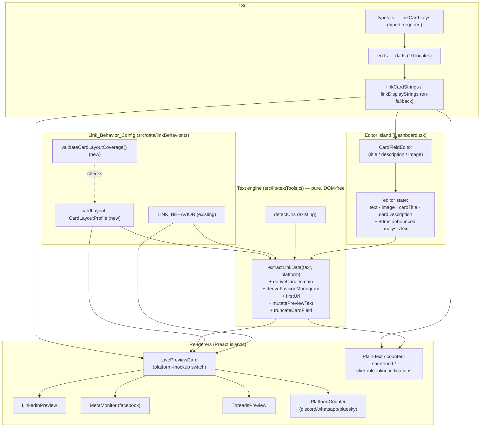

# Design Document

## Overview

This feature teaches the live preview editor to simulate what real social platforms do when a URL
appears in the post body: collapse the link into a rich, view-only Open Graph–style preview card on
the six `preview-card` platforms (Facebook, LinkedIn, Threads, Discord, WhatsApp, Bluesky), and render
an accurate, visually-differentiated non-card treatment on the `plain-text` platforms (Instagram,
TikTok, YouTube Shorts), the `counted-shortened` platform (X/Twitter), and the `clickable-inline`
platforms (Reddit, Pinterest).

Two non-negotiable constraints from the requirements shape every decision below:

1. **No network, ever (Requirement 2).** PostTruncate has no backend that can scrape Open Graph
   metadata, and the browser cannot fetch metadata from arbitrary third-party URLs because of CORS.
   So the card's `Card_Title` and `Card_Description` come from **user-editable mock fields** with smart
   placeholder prefill, the `Card_Image` comes from the **existing in-memory media-attachment object
   URL**, and the `Card_Domain` plus a `Card_Favicon` glyph are **derived locally** from the typed
   URL. Nothing in this feature issues a request to the linked site or any third party — not even for
   a favicon image (which is why the favicon is a locally-rendered monogram, not a fetched `.ico`).

2. **`src/data/linkBehavior.ts` is the single source of truth (Requirement 14).** The platform
   classification this feature depends on — `model`, `countMode`, `cardFromFirstUrlOnly`,
   `byteIndexedFacets`, `bioLinkAllowance` — already exists in `LINK_BEHAVIOR`. This feature **extends**
   that module with a new `cardLayout` (`Card_Layout_Profile`) record per preview-card platform rather
   than duplicating any platform list, and reuses the existing `detectUrls` from `src/lib/textTools.ts`
   for URL detection and first-URL selection.

The work is additive and backward-compatible by construction (Requirement 16). The text engine gains
**new exported pure functions only**; `detectUrls`, `weightedLength`, and `charCount` keep their
signatures and results. Every card and field-editor surface renders **only when `detectUrls` finds a
URL** — when the body has no URL, every existing preview renders exactly as it does today.

### Key design decisions and rationale

- **A pure extraction layer, separate from rendering.** The user proposed a single
  `extractLinkData(text)`. The design splits this into small, individually testable pure functions in
  the text engine (`deriveCardDomain`, `deriveFaviconMonogram`, `firstUrl`, `mutatePreviewText`) plus
  one orchestrator `extractLinkData(text, platform)` that composes them. This keeps each rule
  property-testable and keeps the Preact island a thin renderer (mirrors how `textTools.ts` already
  backs the previews).

- **The card metadata is editor state, not engine state.** `Card_Title`, `Card_Description`, and the
  attached image are user-editable, so they live in `Dashboard.tsx` state next to the existing `text`
  and `image` state and flow down as props — exactly like `image`/`mediaKind` flow today. Placeholders
  are derived purely from the domain/locale and never overwrite user input.

- **`LivePreviewCard` is one component, reused across surfaces.** The same `<LivePreviewCard>` renders
  the Facebook/LinkedIn/Threads cards embedded inside the existing editor previews, and the
  Discord/WhatsApp/Bluesky cards (which have no editor preview today) on their `PlatformCounter` tool
  pages. The per-platform visual differences are data (`cardLayout`), not branched components, so a
  platform's look is one config edit.

- **Favicon is a local monogram, not a fetched icon.** Requirement 3.4 + 2.2 forbid contacting the
  linked site. A real `https://domain/favicon.ico` `` would issue a request, so the favicon is a
  monogram chip (first letter of the domain) rendered with the existing `Avatar`/`monogram` helpers —
  zero network, deterministic, theme-aware.

## Architecture



### Data flow

1. The user types into the `Workspace` textarea. `Dashboard.tsx` already debounces the text into
   `analysisText` over 80ms and persists the raw text to `sessionStorage`. No change to that loop.
2. For the selected platform, the renderer calls `extractLinkData(analysisText, platform)`. That pure
   call returns the first URL (or `undefined`), the locally-derived `Card_Domain` + favicon monogram,
   the smart `Card_Title` placeholder, and the platform-mutated display text.
3. If a URL is present **and** the platform is a `preview-card` platform, `LivePreviewCard` renders
   that platform's mockup using the `cardLayout` profile, the user-edited (or placeholder) title and
   description, and the attached image. The `CardFieldEditor` is shown so the user can edit the card.
4. If a URL is present on a non-card platform, the renderer shows the platform-appropriate indication
   (plain-text / clickable-inline / counted-shortened) — no card, no field editor.
5. If no URL is present, nothing link-specific renders; every preview behaves exactly as today.

All of step 2's logic is pure and DOM-free, so it is unit/property testable without mounting any
island. Steps 3–5 are thin rendering.

### Surface integration map

| Platform | `model` | Editor surface today | Where the card/indication renders |
|---|---|---|---|
| Facebook | preview-card | `MetaMonitor` (facebook branch) | `LivePreviewCard` embedded in the Facebook preview |
| LinkedIn | preview-card | `LinkedInPreview` | `LivePreviewCard` embedded in the LinkedIn preview |
| Threads | preview-card | `ThreadsPreview` | `LivePreviewCard` embedded in the Threads preview |
| Discord | preview-card | none (counter page) | `LivePreviewCard` on the Discord `PlatformCounter` page |
| WhatsApp | preview-card | none (counter page) | `LivePreviewCard` on the WhatsApp `PlatformCounter` page |
| Bluesky | preview-card | none (counter page) | `LivePreviewCard` on the Bluesky `PlatformCounter` page |
| Instagram / TikTok / YouTube | plain-text | Meta/TikTok previews + counters | non-clickable plain-text indication |
| X/Twitter | counted-shortened | `TwitterPreview` | existing 23-char treatment, no card |
| Reddit / Pinterest | clickable-inline | counter pages | clickable-inline indication |

The `CardFieldEditor` lives in the editor column (next to the existing media-attach control in
`Workspace`/`Dashboard`), so it is only available where the editor owns card state — the homepage and
the scoped platform pages. On the standalone `PlatformCounter` pages the card renders read-only from
the typed URL with placeholder metadata.

## Components and Interfaces

### 1. Link_Behavior_Config extension (`src/data/linkBehavior.ts`)

A new `Card_Layout_Profile` type is added and attached to each preview-card record via a new
`cardLayout` field. The existing `OrganicLinkBehavior`, `AdLinkBehavior`, `LinkBehaviorRecord`,
`validateLinkBehaviorCoverage`, `organicLinkBehavior`, and `adLinkBehavior` are unchanged
(Requirement 16.3).

```typescript
/** How a platform presents the card image. */
export type CardImageStyle =
  | 'large'      // full-width banner at Card_Image_Ratio (Facebook, LinkedIn, Threads, Bluesky)
  | 'thumbnail'  // small square/rounded thumbnail in a horizontal chip (reserved; unused after the 2026 Threads re-review)
  | 'embed';     // image inside an embed body with a leading accent bar (Discord, WhatsApp)

/** Casing applied to the displayed Card_Domain. */
export type CardDomainCasing = 'uppercase' | 'lowercase' | 'as-is';

/** Where the Card_Domain sits relative to the title within the card panel. */
export type CardDomainPlacement =
  | 'above-title'  // domain header line above the title (Facebook)
  | 'below-title'  // domain footer line under the title (LinkedIn, Threads, Bluesky, WhatsApp)
  | 'site-name';   // domain shown as the embed "site name" (Discord)

/**
 * Per-preview-card-platform visual link-card facts. The single source of truth
 * for how each platform's Rich_Link_Card looks; the renderer reads these values
 * rather than hard-coding them (Requirement 6.2).
 */
export interface CardLayoutProfile {
  /** Large-image aspect ratio as "w:h" (Open Graph large = "1.91:1"). */
  imageRatio: string;
  /** Image presentation style for this platform. */
  imageStyle: CardImageStyle;
  /** Card_Title truncation length in grapheme clusters. */
  titleMaxChars: number;
  /** Card_Description truncation length; 0 omits the description region (Requirement 7.5). */
  descriptionMaxChars: number;
  /** Casing applied to the displayed Card_Domain (Facebook = uppercase). */
  domainCasing: CardDomainCasing;
  /** Placement of the Card_Domain within the card. */
  domainPlacement: CardDomainPlacement;
  /** True when the raw URL text is dropped from the post body once the card renders. */
  removesRawUrl: boolean;
  /** ISO YYYY-MM-DD date the layout facts were last reviewed (Requirement 6.4). */
  lastReviewed: string;
}
```

`cardLayout?: CardLayoutProfile` is added to `LinkBehaviorRecord`. Populated values (sourced from each
platform's 2025/26 link-card presentation):

| Platform | imageRatio | imageStyle | titleMax | descMax | domainCasing | domainPlacement | removesRawUrl |
|---|---|---|---|---|---|---|---|
| `facebook` | 1.91:1 | large | 80 | 200 | uppercase | above-title | true |
| `linkedin` | 1.91:1 | large | 120 | 0 | lowercase | below-title | true |
| `threads` | 1.91:1 | large | 70 | 0 | lowercase | below-title | true |
| `discord` | 1.91:1 | embed | 100 | 350 | lowercase | site-name | false |
| `whatsapp` | 1.91:1 | embed | 70 | 140 | lowercase | below-title | false |
| `bluesky` | 1.91:1 | large | 100 | 200 | lowercase | below-title | true |

`descMax: 0` for LinkedIn and Threads means the description region is omitted (their real cards show
title + domain only). Discord and WhatsApp keep the raw URL inline (`removesRawUrl: false`) because the
embed/bubble renders beneath a still-visible link; the other four drop it.

#### Coverage validation (new, additive)

```typescript
export interface CardLayoutCoverageResult {
  ok: boolean;
  /** preview-card platform ids missing a cardLayout record. */
  missingCardLayout: string[];
}

/**
 * Verify every preview-card platform has a Card_Layout_Profile (Requirement 6.3).
 * Pure: the canonical preview-card id list is passed in so it is unit-testable
 * and callable from a build/test guard. Reports the offending ids.
 */
export function validateCardLayoutCoverage(previewCardPlatforms: string[]): CardLayoutCoverageResult;

/** Look up a platform's card layout profile; undefined if not a configured preview-card platform. */
export function cardLayout(platform: string): CardLayoutProfile | undefined;
```

A `linkBehavior.cardLayout.test.ts` calls `validateCardLayoutCoverage` with the six preview-card ids
(derived from `LINK_BEHAVIOR` entries whose `organic.model === 'preview-card'`) and fails naming any
platform missing a profile (Requirement 6.3).

### 2. Text engine additive functions (`src/lib/textTools.ts`)

All existing exports are untouched (Requirement 16.4). New pure exports:

```typescript
/** Locally-derived card metadata + display text for one platform. */
export interface ExtractedLinkData {
  /** The first detected URL match, or undefined when the body has no URL. */
  firstUrl?: UrlMatch;
  /** Host with any leading "www." removed, case-folded; '' when no URL. */
  domain: string;
  /** Single-letter monogram for the local favicon glyph (e.g. 'E' for example.com); '' when no URL. */
  faviconMonogram: string;
  /** True when the URL parsed to a valid host; false => render raw URL as domain, omit favicon (Req 3.5). */
  hasValidHost: boolean;
  /** Smart Card_Title placeholder derived from the domain (e.g. "example.com"); '' when no URL. */
  titlePlaceholder: string;
  /** Post body text after applying the platform's raw-URL handling for the PREVIEW only. */
  previewText: string;
  /** Whether this platform removes the raw URL once the card renders (from cardLayout). */
  removesRawUrl: boolean;
}

/**
 * Derive the Card_Domain from a detected URL: the host component with any
 * leading "www." removed and case-folded to lower case. Accepts scheme-less
 * URLs (e.g. "example.com/path") by prepending a synthetic scheme before
 * parsing. Returns null when no valid host can be parsed (Requirement 3.1–3.3, 3.5).
 */
export function deriveCardDomain(url: string): string | null;

/** First letter (upper-cased) of the domain, for the local favicon monogram. '' for empty/invalid. */
export function deriveFaviconMonogram(domain: string): string;

/** The first detected URL in document order, or undefined (Requirement 5). Reuses detectUrls. */
export function firstUrl(text: string): UrlMatch | undefined;

/**
 * Produce the preview body text. When `removeUrl` is true the first detected
 * URL substring is removed and the surrounding whitespace collapsed; otherwise
 * the text is returned unchanged. NEVER mutates the source — returns a new
 * string for display only (Requirement 9.1–9.3).
 */
export function mutatePreviewText(text: string, removeUrl: boolean): string;

/**
 * Grapheme-safe truncation for a card field. Returns the text unchanged when
 * within `max`, otherwise the first `max` grapheme clusters plus a single "…".
 * `max === 0` returns '' (caller omits the region). Reuses sliceChars/charCount
 * so emoji and combining marks are never split (Requirement 7).
 */
export function truncateCardField(text: string, max: number): string;

/**
 * Orchestrator: compose the above into the data a renderer needs for one
 * platform. Pure and DOM-free. Reads platform classification + cardLayout from
 * LINK_BEHAVIOR (the single source of truth) and detects URLs via detectUrls.
 */
export function extractLinkData(text: string, platform: string): ExtractedLinkData;
```

`extractLinkData` uses `firstUrl` for selection (Requirement 5: all preview-card platforms build from
the first URL; `cardFromFirstUrlOnly` additionally drives the "which URL became the card" indication).
`deriveCardDomain` is the only place host parsing happens, so the domain shown is always a case-folded
suffix of the real host (Requirement 3.2) and never fabricated.

### 3. `LivePreviewCard` component (new island, `src/components/island/LivePreviewCard.tsx`)

```typescript
interface LivePreviewCardProps {
  /** Selected platform id (must be a preview-card platform to render a card). */
  platform: string;
  /** The (already debounced) post body text. */
  text: string;
  /** User-edited card title; falls back to the smart placeholder when empty. */
  cardTitle?: string;
  /** User-edited card description; falls back to a localized placeholder when empty. */
  cardDescription?: string;
  /** Attached media object URL (reuses the editor's existing image state), or null. */
  image?: string | null;
  mediaKind?: 'image' | 'video';
  lang: string;
  s: IslandStrings;
}
```

Behavior:

- Calls `extractLinkData(text, platform)`. If `firstUrl` is undefined or the platform is not a
  preview-card platform, it renders `null` (the host preview shows its normal content).
- Looks up `cardLayout(platform)` and renders the matching mockup via an internal switch on
  `imageStyle` + `domainPlacement` + per-platform chrome. Title/description are run through
  `truncateCardField` with the profile's lengths; a `descriptionMaxChars` of 0 omits the description
  (Requirement 7.5). The domain is cased per `domainCasing` and placed per `domainPlacement`.
- Renders the card as a **non-interactive visual element** — an `<article>`/`<div>` container, never
  wrapped in an `<a href>` anchor — so activating it neither navigates to nor opens `firstUrl.url` or
  any other URL (Requirement 10.1, 10.2). It carries no link role; it presents to assistive technology
  as a static preview with an `aria-label` composed from the title and domain (a static accessible
  name, not a clickable link) (Requirement 10.3, 10.5). No `target`/`rel` attributes are emitted because
  there is no anchor and no new browsing context is opened.
- Uses the locally-rendered favicon monogram (no network) unless `hasValidHost` is false, in which case
  it shows the raw URL as the domain and omits the favicon (Requirement 3.5).
- Styles strictly with Tailwind v4 design tokens already in the project (`bg-canvas`, `text-ink`,
  `text-mute`, `border-hairline`, `rounded-*`, shadow tokens) so dark mode and contrast follow the
  existing token swap (Requirement 13.1, 13.4). Image alt text comes from the title or a localized
  default (Requirement 13.2). Reuses `FeedImage`, `Avatar`/`monogram`, and `Card` primitives from
  `ui.tsx`.

### 4. `CardFieldEditor` component (new, in the editor column)

Rendered by `Dashboard.tsx` only while a card is shown (a URL is present on the selected preview-card
platform). Provides:

- An editable `Card_Title` text input and `Card_Description` textarea, both keyboard-operable with
  labels resolved from i18n (Requirement 4.1, 13.3). Edits update `Dashboard` state and flow into the
  card within the existing debounce cycle (Requirement 4.2).
- The image is **not** a separate control — it reuses the editor's existing media-attachment object URL
  (`image`/`onSelectImage` already in `Workspace`/`Dashboard`), satisfying Requirement 4.3 without a new
  upload mechanism. When no image is attached, the card renders its no-image form per `cardLayout`
  (Requirement 4.5).

### 5. `Dashboard.tsx` integration

Additive state, mirroring the existing `image` state pattern:

```typescript
const [cardTitle, setCardTitle] = useState('');
const [cardDescription, setCardDescription] = useState('');
```

- These pass down to the preview islands (`LinkedInPreview`, `MetaMonitor`, `ThreadsPreview`) and the
  `CardFieldEditor`. The existing `analysisText`, `image`, `mediaKind` props already thread through —
  the new props ride alongside.
- Draft persistence (Requirement 16.4): `cardTitle`/`cardDescription` are added to the existing
  `sessionStorage` draft. Today the draft is a bare string; it becomes a small JSON envelope
  `{ text, cardTitle, cardDescription }` with a **back-compat read** that treats a legacy plain-string
  value as `{ text }`. The attached image stays in-memory only (unchanged).
- The 80ms analysis debounce and 250ms storage debounce are unchanged; card updates piggyback on
  `analysisText` (Requirement 1.3, 4.2).

### 6. Preview-island embedding

`LinkedInPreview`, `MetaMonitor` (facebook branch), and `ThreadsPreview` gain optional
`cardTitle`/`cardDescription` props and render `<LivePreviewCard …/>` in place of (or above) their
normal body when `extractLinkData` reports a URL and the platform removes the raw URL. The body text
they render is `mutatePreviewText(text, removesRawUrl)` so the URL is dropped from the visible copy
when the platform drops it (Requirement 9.1) and kept inline otherwise (Requirement 9.2). The character
counters in these previews keep measuring the **full** `text` (Requirement 9.4) — only the rendered
body is mutated.

The Discord/WhatsApp/Bluesky cards render via `LivePreviewCard` on their respective `PlatformCounter`
tool pages, which already receive the typed text and platform id.

### 7. i18n (`src/i18n/types.ts`, all 10 locales, resolver)

A new **required** `linkCard` sub-object is added to `IslandStrings` and declared in `types.ts`, so a
missing key in any locale is a TypeScript error (Requirement 15.2) and the parity lint
(`scripts/check-i18n.mjs`) only passes when all ten locales carry the exact key paths. `en.ts` is the
canonical source and the other nine are translated (Requirement 15.3).

```typescript
export interface LinkCardStrings {
  /** Card_Field_Editor section heading. */
  editorHeading: string;
  /** Title input label. */
  titleLabel: string;
  /** Description input label. */
  descriptionLabel: string;
  /** Title input placeholder (smart placeholder shown when empty is domain-derived at runtime). */
  titlePlaceholder: string;
  /** Description placeholder used when the user supplies none (Requirement 2.4). */
  descriptionPlaceholder: string;
  /** Accessible name template for the static (non-link) preview card. "{title}" / "{domain}" tokens, applied as an aria-label on the non-interactive container (Requirement 10.5). */
  cardAria: string;
  /** Default image alt text when no title is available (Requirement 13.2). */
  imageAlt: string;
  /** "The first link becomes the preview card." indication for cardFromFirstUrlOnly (Requirement 5.2). */
  firstUrlNote: string;
}
```

A resolver `linkCardStrings(s)` returns `s.linkCard` and is used by `LivePreviewCard` and
`CardFieldEditor`. Because `linkCard` is required and typed, the runtime value is always present; the
resolver still guards partial/absent values by falling back to the canonical English block at render
(Requirement 15.4). The non-card indications (plain-text, clickable-inline, counted-shortened, bio
allowance) reuse the **existing** `linkDisplayStrings(s)` resolver and `LinkDisplayStrings`
(Requirement 11.2, 12.3, 14) — this feature does not duplicate those strings.

## Data Models

### CardLayoutProfile

The authoritative shape is defined in *Components and Interfaces §1*. Modeling notes:

- **`imageRatio` is a string `"w:h"`**, not a number, so the design document and config read the same
  way humans describe Open Graph ratios ("1.91:1"). The renderer parses it once to a CSS aspect-ratio.
- **`descriptionMaxChars: 0` is the explicit "omit description" signal** (Requirement 7.5), distinct
  from a small positive cap. LinkedIn and Threads use it.
- **`titleMaxChars`/`descriptionMaxChars` are grapheme-cluster counts**, applied with the existing
  grapheme-safe `sliceChars`/`charCount` so emoji are never split (Requirement 7.4).
- **`removesRawUrl` is a per-platform boolean**, the single source for the raw-URL handling in
  Requirement 9. The renderer reads it; it is never inferred from the model.
- **`lastReviewed` is required on every profile** (Requirement 6.4), ISO `YYYY-MM-DD`.

### ExtractedLinkData

Defined in *Components and Interfaces §2*. It is a pure value object — the renderer consumes it and
holds no logic. `firstUrl` reuses the existing `UrlMatch` (`{ url, start, end }`) so offsets and
detection stay owned by `detectUrls`.

### Editor card state and draft envelope

```typescript
interface DraftEnvelope {
  text: string;
  cardTitle?: string;
  cardDescription?: string;
}
```

Persisted to `sessionStorage` under the existing `post_truncate_active_draft` key. A legacy plain
string is read as `{ text: <string> }` for backward compatibility (Requirement 16.4). The attached
image is intentionally **not** persisted (in-memory object URL only, unchanged behavior).

### Relationship to existing config (preserved)

`LINK_BEHAVIOR` keeps every existing field and value; `cardLayout` is additive and optional on the
record, present only for the six preview-card platforms (Requirement 14.1, 14.2, 16.3). The
`fixedLinkWeight`, `cardFromFirstUrlOnly`, `byteIndexedFacets`, and `bioLinkAllowance` values are read
as-is and never redefined here (Requirement 14.1).

## Correctness Properties

*A property is a characteristic or behavior that should hold true across all valid executions of a system — essentially, a formal statement about what the system should do. Properties serve as the bridge between human-readable specifications and machine-verifiable correctness guarantees.*

Here, property-based testing **is** appropriate for this feature: the extraction layer
(`deriveCardDomain`, `deriveFaviconMonogram`, `firstUrl`, `mutatePreviewText`, `truncateCardField`,
`extractLinkData`), the config-coverage checks, and the i18n resolver are pure functions over a large,
structured input space (arbitrary post text, URLs with and without schemes, `www.` prefixes, emoji and
combining marks, multiple URLs, every configured platform id). The card markup, theme/contrast, and
keyboard accessibility are covered by example/render tests instead (see Testing Strategy). The
properties below were consolidated from the prework to remove redundancy (the five truncation criteria,
the three domain-derivation criteria, the render-trigger criteria, and the indication-selection
criteria were each merged into a single comprehensive property).

### Property 1: Card-render trigger

*For all* post text inputs and *for all* platform ids, the decision to render a Rich_Link_Card is true
exactly when `detectUrls(text)` is non-empty **and** that platform's `organicLinkBehavior(platform).model`
is `'preview-card'`; otherwise it is false (no card, no field editor).

**Validates: Requirements 1.1, 1.2, 16.1**

### Property 2: Domain derivation is a case-folded suffix of the real host

*For all* detected URLs that parse to a valid host (including scheme-less URLs and URLs whose host
begins with `www.`), `deriveCardDomain(url)` returns a lower-cased string that is a suffix of the URL's
lower-cased host with any single leading `www.` removed — never fabricated text absent from the host.

**Validates: Requirements 3.1, 3.2, 3.3**

### Property 3: Local favicon monogram derivation

*For all* valid domains, `deriveFaviconMonogram(domain)` returns the upper-cased first alphanumeric
character of that domain, computed locally with no network access.

**Validates: Requirements 3.4**

### Property 4: Smart title placeholder derives from the domain

*For all* URLs with a valid host, `extractLinkData(text, platform).titlePlaceholder` is derived solely
from `deriveCardDomain(url)` (a function of the real host), so the placeholder never contains text
absent from the URL host.

**Validates: Requirements 2.3**

### Property 5: First-URL selection

*For all* post text inputs containing at least one URL and *for all* preview-card platforms,
`extractLinkData(text, platform).firstUrl` equals `detectUrls(text)[0]` (the first URL in document
order), whether or not `cardFromFirstUrlOnly` is set.

**Validates: Requirements 5.1, 5.3**

### Property 6: Card_Layout_Profile coverage and shape

*For all* preview-card platform ids (those whose `model === 'preview-card'`), `cardLayout(platform)` is
defined and its fields are well-formed: `imageStyle ∈ {large, thumbnail, embed}`, `domainCasing ∈
{uppercase, lowercase, as-is}`, `domainPlacement ∈ {above-title, below-title, site-name}`,
`titleMaxChars` and `descriptionMaxChars` are non-negative integers, and `removesRawUrl` is a boolean.
`validateCardLayoutCoverage` reports exactly the platforms lacking a profile (empty for the real list).

**Validates: Requirements 6.1, 6.3, 14.2**

### Property 7: lastReviewed is a valid ISO date

*For all* `cardLayout` profiles, `lastReviewed` matches `^\d{4}-\d{2}-\d{2}$` and is a valid calendar
date.

**Validates: Requirements 6.4**

### Property 8: Grapheme-safe card-field truncation

*For all* field text inputs (including emoji, ZWJ sequences, and combining marks) and *for all*
`max >= 0`: when `max === 0` the result is `''`; when `charCount(text) <= max` the result equals `text`
unchanged with no ellipsis; when `charCount(text) > max` the result is the first `max` whole grapheme
clusters of `text` followed by exactly one `'…'`, and the portion before the ellipsis is a
whole-grapheme prefix of `text` (no cluster is split).

**Validates: Requirements 7.1, 7.2, 7.3, 7.4, 7.5**

### Property 9: Preview text mutation removes only the first URL and never mutates the source

*For all* post text inputs and the boolean `removeUrl`: `mutatePreviewText(text, false)` equals `text`;
when `text` contains at least one URL, `mutatePreviewText(text, true)` does not contain the first
detected URL substring and removes only that first occurrence; and in all cases the input `text` value
is unchanged after the call (a new string is returned).

**Validates: Requirements 9.1, 9.2, 9.3**

### Property 10: Counters always measure the full body text

*For all* post text inputs, `charCount(text)` and `weightedLength(text)` are computed from the full
body (including all URL characters) and are independent of any preview URL omission — they equal the
values produced before any `mutatePreviewText` is applied.

**Validates: Requirements 9.4, 12.1**

### Property 11: Non-card platforms retain the inline URL and render no card

*For all* post text inputs containing a URL and *for all* platforms whose model is `plain-text`,
`counted-shortened`, or `clickable-inline`, the card-render decision is false and
`extractLinkData(text, platform).previewText` equals `text` (the URL is kept inline, not removed).

**Validates: Requirements 11.1, 12.1, 12.2**

### Property 12: Link-display indication is selected by model

*For all* configured platforms and *for all* post text inputs: when the body has no detected URL the
indication is "none"; when it has at least one URL the selected indication key is exactly the one mapped
from the platform's model — `plain-text → plainText`, `preview-card → previewCard`, `clickable-inline →
clickableInline`, `counted-shortened → countedShortened`.

**Validates: Requirements 11.2, 12.3**

### Property 13: Displayed link facts match the config

*For all* platforms and *for all* link-display facts the UI derives from the config (bio-link
allowance number, domain casing, fixed link weight, raw-URL removal), the value used by the renderer
equals the value stored in `LINK_BEHAVIOR`/`cardLayout` — the fact is derived solely from the config and
never fabricated.

**Validates: Requirements 11.3, 14.1, 14.3**

### Property 14: Engine backward compatibility

*For all* post text inputs, `detectUrls(text)`, `weightedLength(text)`, and `charCount(text)` produce
the same results as before this feature (the new exports are additive and do not change existing
behavior).

**Validates: Requirements 14.4, 16.1, 16.2**

### Property 15: i18n en-fallback resolution

*For all* locales and *for all* `linkCard`/`linkDisplay` keys, the resolver returns the locale's own
value when present and the canonical English value when the locale's value is absent.

**Validates: Requirements 15.4**

### Property 16: Draft envelope round-trip

*For all* draft envelopes `{ text, cardTitle?, cardDescription? }`, parsing the serialized form yields
an equal envelope; *for all* legacy plain-string drafts, parsing yields `{ text: <string> }`.

**Validates: Requirements 16.4**

### Property 17: Card renders as a non-interactive, non-link element

*For all* post text inputs containing a URL and *for all* preview-card platforms, the rendered
Rich_Link_Card is a non-interactive element: it contains **no** anchor/`href` referencing the detected
URL (or any URL) and exposes **no** link role to assistive technology, while it still exposes a static
accessible name derived from the Card_Title and Card_Domain and (when an image is present) image
alternative text derived from the Card_Title. Equivalently, querying the rendered card for a link role
or for an `href` equal to `firstUrl.url` yields nothing.

**Validates: Requirements 10.1, 10.2, 10.3, 10.5**

## Error Handling

The extraction layer is pure and total — it returns values rather than throwing for ordinary inputs —
so error handling centers on edge inputs and the no-network guarantee.

- **No URL in the body.** `detectUrls` returns `[]`, so `extractLinkData` returns `firstUrl: undefined`,
  empty domain/favicon/placeholder, and `previewText === text`. Every preview renders exactly as today;
  no card, no field editor (Requirements 1.2, 16.1).
- **Unparseable URL host.** `deriveCardDomain` returns `null`; `extractLinkData` sets
  `hasValidHost: false`, uses the raw detected URL text as the displayed domain, and emits an empty
  favicon monogram so the card omits the favicon (Requirement 3.5). It never throws.
- **Scheme-less URL.** `deriveCardDomain` prepends a synthetic `https://` before parsing so
  `example.com/path` still yields `example.com` (Requirement 3.3). The synthetic scheme is used only
  for parsing and never displayed.
- **No network by construction.** The favicon is a locally-rendered monogram (no `` to the
  linked site or a third-party favicon service), and no `fetch`/`XMLHttpRequest`/`Image` request is
  issued during extraction or render (Requirements 2.2, 3.4). This is asserted by an integration test
  that spies on network primitives.
- **Empty or zero-length card fields.** Empty `cardTitle` falls back to the domain-derived placeholder;
  empty `cardDescription` falls back to the localized placeholder (Requirements 2.3, 2.4). A platform
  whose `descriptionMaxChars === 0` omits the description region entirely (Requirement 7.5).
- **Emoji / astral / combining input in card fields.** `truncateCardField` uses the existing
  grapheme-safe `sliceChars`/`charCount`, so no cluster is ever split (Requirement 7.4).
- **Unknown / not-yet-wired platform id.** `organicLinkBehavior`/`cardLayout` return `undefined`;
  `LivePreviewCard` renders `null` and the host preview degrades to its normal content. This keeps the
  Discord/WhatsApp/Bluesky rollout safe.
- **Missing card layout (build/test guard).** `validateCardLayoutCoverage` returns the missing
  platform ids; the coverage test fails naming them, gating the build (Requirement 6.3).
- **Corrupt or legacy draft in `sessionStorage`.** The draft reader treats a plain string as
  `{ text }` and ignores malformed JSON (falls back to empty), preserving the existing resilient
  `try/catch` behavior (Requirement 16.4).
- **Missing i18n key at runtime.** The resolver falls back to the canonical English value
  (Requirement 15.4); a genuinely missing typed key is a compile error via `types.ts` (Requirement
  15.2).

## Testing Strategy

This feature uses property-based tests for the pure extraction/config/i18n logic and example/render
tests for the Preact card mockups and accessibility.

### Tooling

- **Test runner:** `node:test` + `node:assert/strict`, matching the existing `src/lib/*.test.ts`
  suites (e.g. `textTools.test.ts`, `adTruncation.test.ts`).
- **Property-based library:** `fast-check` (the standard PBT library for the TypeScript/Node
  ecosystem). PBT is not implemented from scratch. Each property test runs **a minimum of 100
  iterations** (`fc.assert(fc.property(...), { numRuns: 100 })`).
- **Component/render tests:** the project's existing Preact testing setup for the island render
  assertions (non-interactive container, absence of link role/anchor, ARIA names, per-platform layout,
  dark-mode tokens).
- **Generators:** arbitrary post text; a URL arbitrary covering `http(s)://`, scheme-less, and `www.`
  hosts plus malformed tokens; strings with emoji/ZWJ/CJK/combining marks; multi-URL text; the finite
  set of configured platform ids; and draft envelopes.

### Property tests (one test per property above)

Each property test is tagged with a comment referencing its design property:

`// Feature: rich-link-preview-cards, Property N: <property text>`

Property → suite mapping:

- **Properties 1, 5, 9, 10, 11, 12, 14** → `textTools.linkCard.test.ts` (new) — the extraction
  orchestrator, first-URL selection, preview-text mutation, counter independence, non-card retention,
  indication selection, and the engine backward-compat regression.
- **Properties 2, 3, 4, 8** → `linkCardDerivation.test.ts` (new) — domain derivation, favicon monogram,
  title placeholder, and grapheme-safe truncation.
- **Properties 6, 7, 13** → `linkBehavior.cardLayout.test.ts` (new) — config shape/coverage, ISO date,
  and config-fact fidelity. Reuses the real preview-card id list derived from `LINK_BEHAVIOR`.
- **Property 15** → `linkCardStrings.test.ts` (new) — resolver en-fallback.
- **Property 16** → `draftEnvelope.test.ts` (new) — serialize/parse round-trip and legacy-string read.
- **Property 17** → `LivePreviewCard.test.tsx` (new) — across all preview-card platforms and URL
  inputs, the rendered card exposes no link role and no `href` to the detected URL while still exposing
  the static accessible name and image alt text.

### Example / render tests

- **Per-platform card layout (Requirements 8.1–8.6):** render assertions that each platform's card
  matches its `cardLayout` — Facebook uppercase domain above a 1.91:1 image, LinkedIn title+domain,
  Threads large landscape banner (title + domain), Discord accent-bar embed, WhatsApp bubble, Bluesky large card.
- **Non-interactive view-only card (Requirements 10.1–10.5):** the card root is a non-interactive
  container (`<article>`/`<div>`), there is **no** `<a>`/`href` to `firstUrl.url` and no link role
  (e.g. `queryByRole('link')` finds nothing within the card), no `target`/`rel` attributes are present,
  activating it triggers no navigation, and the static `aria-label` contains the title and domain while
  the image `alt` is derived from the title.
- **Field editor (Requirements 4.1–4.5, 13.3):** title input + description textarea render while a card
  is shown, are keyboard-operable with localized labels, edits flow into the card, and the attached
  image renders in the platform's image style (no-image form when absent).
- **First-URL indication (Requirement 5.2):** with multiple URLs on a `cardFromFirstUrlOnly` platform,
  the `firstUrlNote` indication is shown.
- **Bio-link / plain-text / clickable-inline indications (Requirements 11.1, 11.3, 12.2):** render
  assertions for the non-card treatments and the bio-allowance line.
- **Theme & a11y (Requirements 13.1, 13.2, 13.4):** the card uses dark-mode design tokens and arbitrary
  values are absent; image alt text is the title or the localized default.

### Integration / smoke tests

- **No network (Requirements 1.3, 2.2):** a test that spies on `fetch`/`XMLHttpRequest`/`Image` and
  asserts zero calls during extraction and a full card render.
- **i18n parity (Requirements 15.2, 15.3):** `scripts/check-i18n.mjs` passes with the new `linkCard`
  keys present in all ten locales; the type-check fails if any locale omits a key.

### Regression / backward compatibility (Requirement 16)

- The existing `src/lib/*.test.ts` and preview suites run **unmodified**; their assertions guard
  `detectUrls`, `weightedLength`, `charCount`, and the existing fold/truncation/thread-splitting and
  counter behavior of `LinkedInPreview`, `TwitterPreview`, `ThreadsPreview`, and `TikTokPreview` for
  URL-free text (Requirements 16.1, 16.2, 16.3).
- The draft round-trip property and a legacy-string example confirm `sessionStorage` persistence stays
  intact while carrying the new `Card_Metadata` (Requirement 16.4).
