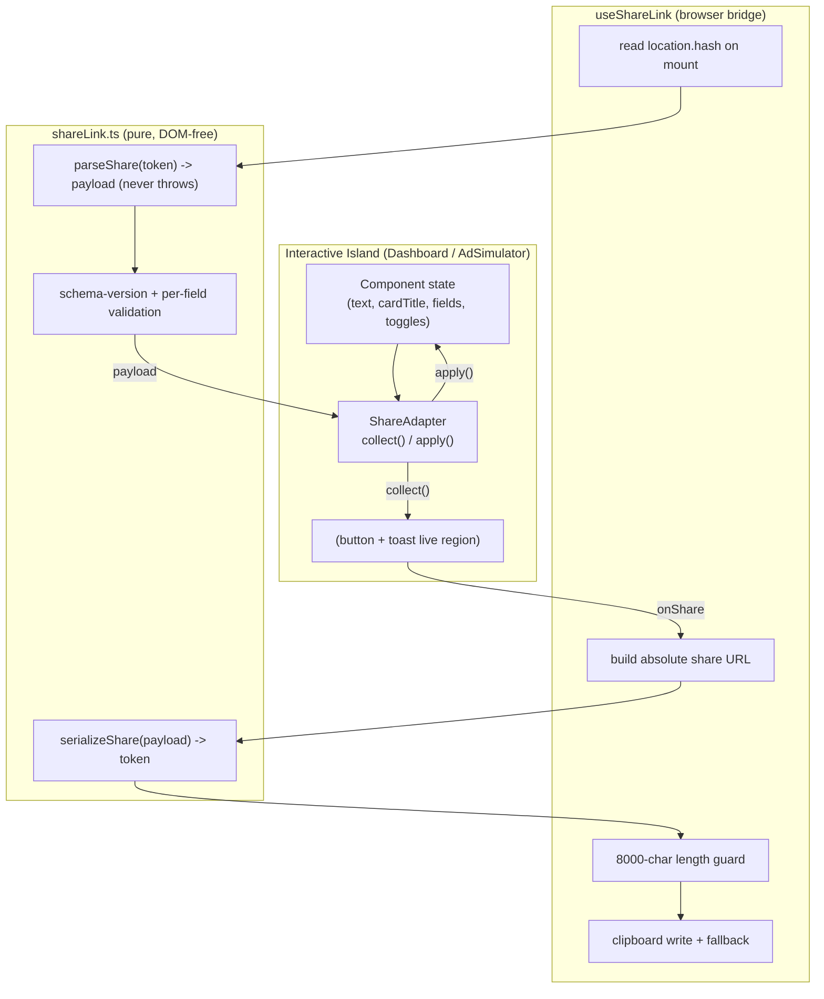

# Design Document

## Overview

The Share Link feature adds a single shareable URL to every interactive preview/tool island. Activating the Share_Button serializes the island's current user-authored state into a compact, URL-safe token, places that token in the URL **hash fragment**, and copies the resulting absolute URL to the clipboard. Opening such a URL re-hydrates the island to the exact shared state — with **no server, no database, no account, and no upload**.

The design is built around three layers, each independently testable and each minimizing blast radius on the existing system:

1. **A pure codec** (`src/lib/shareLink.ts`) — DOM-free, storage-free serialize/parse of a versioned `SharePayload` to/from a `Share_Token`. It mirrors the discipline already proven in `src/lib/draftEnvelope.ts`: never throws, falls back to a safe default, and is fully unit/property testable in isolation.
2. **A framework-agnostic browser bridge** (`src/lib/shareUrl.ts` + a Preact hook `useShareLink`) — reads the token from `location.hash` on mount, builds an absolute share URL from the current page, and handles clipboard + length concerns. This is the only layer that touches the DOM/browser APIs.
3. **Per-island adapters** — a tiny `ShareAdapter` contract that each island (the editor `Dashboard`/`Workspace`, and the `AdSimulator`) implements to (a) *collect* a payload from its current state and (b) *apply* a parsed payload into its initial state.

This separation means the existing islands gain sharing by wiring two functions and rendering one `<ShareControls>` component — their core logic, draft persistence, and rendering are untouched.

### Design Goals

- **Zero-database / privacy-preserving.** All shared state lives in the URL fragment, which browsers never send to the server. Nothing is written to any backend.
- **Additive and non-breaking.** The existing `sessionStorage` draft envelope (`post_truncate_active_draft`) keeps working unchanged. Sharing is layered on top; when no token is present, every island behaves exactly as today.
- **Robust by construction.** The codec never throws and always degrades to a safe default state, so a damaged or future-version link can never break a page.
- **Localized and accessible** across all ten locales, with the same typed-string discipline the project already enforces.

### Goals vs. Non-Goals

| In scope | Out of scope |
|---|---|
| Encoding post body text + card title/description (editor tools) | Persisting/sharing attached media (image/video) — intentionally excluded |
| Encoding ad field values + view toggles (ad-preview tools) | Server-side short links / link storage / analytics |
| Versioned, compressed, URL-safe token in the hash fragment | Editing a shared link after the fact / collaboration |
| Clipboard copy with manual-copy fallback + toasts | Authentication or per-user link management |
| State reconstruction on load with graceful degradation | Changing the existing draft auto-save semantics |

## Architecture



### Module Inventory

| Path | Type | Responsibility | DOM access |
|---|---|---|---|
| `src/lib/shareLink.ts` | New, pure | `SharePayload` types, `SCHEMA_VERSION`, `serializeShare`, `parseShare`, validation/coercion helpers | None |
| `src/lib/shareUrl.ts` | New, pure-ish | Build absolute share URL from a base URL + token; extract token from a hash string; canonical-origin resolution for embeds | None (takes strings in, returns strings) |
| `src/components/island/useShareLink.ts` | New, Preact hook | Orchestrates read-on-mount, copy, clipboard fallback, length guard, toast state | Yes (only here) |
| `src/components/island/ShareControls.tsx` | New, Preact | Share_Button + ARIA-live toast region; consumes `useShareLink` | Yes |
| `src/components/island/Dashboard.tsx` | Edit | Provide editor `ShareAdapter`; apply payload on mount with precedence over draft; render `<ShareControls>` | — |
| `src/components/island/Workspace.tsx` | Edit (light) | Host the `<ShareControls>` button in the editor header/action row | — |
| `src/components/island/AdSimulator.tsx` | Edit | Provide ad `ShareAdapter`; apply payload on mount; render `<ShareControls>` | — |
| `src/i18n/types.ts` | Edit | Add required `share` block to `IslandStrings` | — |
| `src/i18n/en.ts` … `da.ts` | Edit | Provide `share` strings for all ten locales (English canonical) | — |

The third-party-facing **embed widget** (`/[lang]/embed/`) and **embed-widget** pages are read in the design but the Share_Button is *not* mounted inside the iframe chrome; instead, when a share link is generated from a page that is itself framed, the URL targets the canonical hosted page (see Requirement 13.4 handling under "URL construction").

## Components and Interfaces

### 1. The codec — `src/lib/shareLink.ts`

The codec is the heart of the feature and the primary PBT target. It is intentionally modeled on `draftEnvelope.ts`: pure, synchronous, never-throwing.

#### Data model

```ts
/** Bumped only on incompatible payload-shape changes. */
export const SCHEMA_VERSION = 1;

/** Discriminates the two island families. */
export type ShareKind = 'editor' | 'ad';

/** Editor-tool state (post body + optional Rich Link Card metadata). */
export interface EditorShareState {
  kind: 'editor';
  /** Post body text. Field name matches Draft_Envelope. */
  text: string;
  /** Present only when non-empty / non-whitespace. */
  cardTitle?: string;
  /** Present only when non-empty / non-whitespace. */
  cardDescription?: string;
}

/** Ad-preview-tool state (field values keyed by id + view toggles). */
export interface AdShareState {
  kind: 'ad';
  /** Source simulator platform identifier (e.g. 'google' | 'facebook' | ...). */
  platform: string;
  /** Non-empty field values keyed by field id (headline1, primary, ...). */
  fields: Record<string, string>;
  /** View toggles; each key present only when meaningful for the platform. */
  view: {
    device?: 'mobile' | 'desktop';
    mode?: 'feed' | 'reels';
    safeZone?: boolean;
    destinationUrl?: string;
    cta?: string;
    finalUrl?: string;
    paths?: string[];
  };
}

export type ShareState = EditorShareState | AdShareState;

/** The full versioned envelope that is serialized into the token. */
export interface SharePayload {
  v: number;            // Schema_Version
  state: ShareState;
}
```

#### Public API

```ts
/** Serialize a payload into a URL-safe Share_Token (compressed). */
export function serializeShare(payload: SharePayload): string;

/**
 * Parse a Share_Token back into a SharePayload. NEVER throws.
 * Returns a default-state payload (see DEFAULT_PAYLOAD) for any input that is
 * empty, malformed, truncated, version-incompatible, or structurally invalid.
 */
export function parseShare(token: string | null | undefined): SharePayload | null;

/** Strip empty / whitespace-only string fields from a collected state. */
export function pruneEmptyFields(state: ShareState): ShareState;
```

`parseShare` returns `null` (rather than a payload) when there is **no usable shared state** so callers can cleanly fall through to their normal defaults (e.g. the editor's `sessionStorage` draft). When a token decodes to a recognizable-but-partially-invalid payload, it returns a payload with only the valid fields retained.

#### Encoding pipeline

```
serialize:  SharePayload --JSON.stringify--> json
            json --compress (URL-safe)--> token

parse:      token --decompress--> json | null
            json --JSON.parse (guarded)--> unknown | null
            unknown --validate/coerce--> SharePayload | null
```

- **Compression + URL-safety (Req 9.1, 4.2).** Use **`lz-string`**'s `compressToEncodedURIComponent` / `decompressFromEncodedURIComponent`. These are synchronous, dependency-light, produce output drawn from a URL-safe alphabet (`A–Z a–z 0–9 + - $`, no characters requiring percent-encoding inside a fragment), and are purpose-built for stuffing data into URLs. This keeps the codec pure and synchronous, which is essential for the round-trip property tests. The library version will be **pinned exactly** in `package.json`.
  - *Alternative considered:* the native `CompressionStream('deflate-raw')` + manual base64url. Rejected because it is asynchronous and browser-only, which would force the codec to be async and make pure round-trip testing harder; it also adds no real benefit over `lz-string` at these payload sizes.
- **Validation/coercion (Req 6.3–6.5).** After `JSON.parse`, a guarded validator:
  - confirms the value is a plain object with a numeric `v` and an object `state` carrying a known `kind`;
  - if `v > SCHEMA_VERSION` → return `null` (load defaults, Req 6.4);
  - for `kind: 'editor'`, keeps `text` only if it is a string (else `''`); keeps `cardTitle`/`cardDescription` only if string and non-empty after trim (Req 2.x);
  - for `kind: 'ad'`, keeps `platform` only if string; keeps each `fields` entry only if its value is a string (non-string entries are dropped, Req 6.5); validates each `view` key against its expected type and drops mismatches;
  - any thrown error anywhere is caught and converted to `null` (Req 6.1).

This guarantees the two key correctness properties: **round-trip equality** for valid payloads and **never-throws / safe-default** for everything else.

### 2. The browser bridge — `src/lib/shareUrl.ts` + `useShareLink`

#### `shareUrl.ts` (pure string helpers)

```ts
/** Fragment key the token is stored under: location.hash === `#s=<token>`. */
export const SHARE_HASH_KEY = 's';

/** Extract the Share_Token from a raw hash string (e.g. "#s=abc"), or null. */
export function readShareTokenFromHash(hash: string | null | undefined): string | null;

/**
 * Build an absolute share URL.
 * @param baseUrl  Absolute URL of the current page (origin + locale path).
 * @param token    Share_Token to embed in the fragment.
 */
export function buildShareUrl(baseUrl: string, token: string): string;

/** True when the URL exceeds the shareable length budget (Req 9.2). */
export const MAX_SHARE_URL_LENGTH = 8000;
export function isShareUrlTooLong(url: string): boolean;
```

- The token lives in `location.hash`, never the query string, so it is **never transmitted to or logged by the server** — the cornerstone of the zero-database guarantee (Share_Fragment).
- Keeping these helpers string-pure (no `window`) lets them be unit-tested directly.

#### `useShareLink` (Preact hook — the only browser-touching unit)

```ts
interface UseShareLinkArgs {
  adapter: ShareAdapter;     // collect() / apply(), provided by the island
  strings: ShareStrings;     // localized labels + messages
}

interface UseShareLinkResult {
  onShare: () => Promise<void>;   // build + copy current state
  toast: ToastState | null;       // { tone: 'success'|'error'|'warn', message } 
  manualUrl: string | null;       // set when clipboard unavailable/failed
  dismiss: () => void;
}
```

Behavior:

- **On mount (read path).** Reads `readShareTokenFromHash(window.location.hash)`; if a token exists, `parseShare` it; if the result is non-null and its `kind` matches the adapter, call `adapter.apply(payload.state)`. Mismatched-kind or cross-tool payloads apply only the fields valid for the current tool (Req 5.4) — enforced by the adapter's `apply`. Runs exactly once (guarded), before/around the island's existing draft-load effect so the token wins (Req 8.2).
- **On share (write path).**
  1. `state = adapter.collect()` (already pruned of empty/whitespace fields via `pruneEmptyFields`).
  2. `token = serializeShare({ v: SCHEMA_VERSION, state })`.
  3. `baseUrl = canonicalBaseUrl()` (current `location.origin + pathname`, or the canonical hosted origin when framed — Req 13.4).
  4. `url = buildShareUrl(baseUrl, token)`.
  5. If `isShareUrlTooLong(url)` → show **warning** toast and stop (Req 9.2).
  6. Try `navigator.clipboard.writeText(url)` → **success** toast (Req 1.6).
  7. If clipboard API is missing or rejects → set `manualUrl` and show **error/info** toast prompting manual copy (Req 8.4, 11.1–11.2). The draft envelope is never touched on this path.
- **Toast lifecycle.** A toast auto-dismisses after a fixed duration (e.g. 4s) via a cleared-on-unmount timer (Req 11.3); it is rendered in an `aria-live="polite"` region (Req 12.3).

### 3. `<ShareControls>` — `src/components/island/ShareControls.tsx`

A small presentational component that renders:
- the **Share_Button** with an accessible name (`aria-label` from `strings.share.button`), keyboard-operable as a native `<button type="button">` (Req 12.1–12.2);
- an inline **toast** + optional **manual-copy** field (a read-only `<input>` pre-selected for easy copy) inside an `aria-live` region.

It takes `{ adapter, strings }` and delegates all logic to `useShareLink`. It is intentionally tiny and styled with the existing Tailwind pill-button classes used elsewhere in the islands, so it visually matches current controls.

### 4. The `ShareAdapter` contract

```ts
export interface ShareAdapter {
  /** Discriminator + identity used to gate cross-tool application. */
  readonly kind: ShareKind;
  readonly id: string;                 // tool/platform id
  /** Build a pruned ShareState snapshot of the current island state. */
  collect: () => ShareState;
  /** Apply a parsed ShareState into the island's state (only valid fields). */
  apply: (state: ShareState) => void;
}
```

#### Editor adapter (in `Dashboard.tsx`)

- `kind: 'editor'`, `id`: the active tool/focus id (informational; editor state is tool-agnostic so any editor link applies).
- `collect()`: `pruneEmptyFields({ kind: 'editor', text, cardTitle, cardDescription })` from the existing `text`/`cardTitle`/`cardDescription` state.
- `apply(state)`: when `state.kind === 'editor'`, set `text`, `analysisText`, and (if present) `cardTitle` / `cardDescription`. Leaves media empty (Req 5.5 — media state is simply never set from a payload).

**Precedence over draft (Req 8.1–8.3).** The Dashboard currently loads the draft in a mount effect (`readActiveDraft()`), then auto-saves edits on a debounce. The change: in the same mount effect, first check for a share token; if a valid editor payload exists, initialize state from it **instead of** the draft, then let the existing debounce auto-save take over normally (so subsequent edits persist to the draft as today). When no token is present, the draft-load path is byte-for-byte unchanged.

#### Ad adapter (in `AdSimulator.tsx`)

- `kind: 'ad'`, `id`: the `platform` prop.
- `collect()`: build `{ kind:'ad', platform, fields, view }` where `fields` includes only non-empty `values` entries and `view` includes only the toggles that platform exposes (`CONTROLS[platform]` + link-behavior gating already present in the component): `device`, `mode`, `safeZone`, `destinationUrl`, `cta`, `finalUrl`, `paths`. Pruned via `pruneEmptyFields`.
- `apply(state)`: when `state.kind === 'ad'` **and** `state.platform === platform` (Req 5.4 — ignore payloads for a different simulator), set `values` (merged over `EMPTY_VALUES`, dropping unknown keys), and each present `view` toggle into its corresponding `useState`. Media stays null (Req 5.5).

### Integration points (where the button mounts) — Req 13

| Page route | Island | Share button host |
|---|---|---|
| `[lang]/[tool]/`, `[lang]/tools/[tool]/`, homepage | `Dashboard` → `Workspace` | In the `Workspace` header/action row |
| `[lang]/ad-previews/[tool]/` | `AdSimulator` | In the inputs `Card` header/toolbar |
| `[lang]/platform-limits` | `PlatformCounter` / `Dashboard` matrix | Alongside the editor controls (editor adapter) |

The Astro pages themselves need **no structural change** — the button lives inside the already-mounted client islands, so SSR/SEO output is unaffected.

## Data Models

### Token shape on the wire

A generated URL looks like:

```
https://posttruncate.com/en/twitter-character-counter/#s=N4Ig...   (editor)
https://posttruncate.com/en/ad-previews/facebook-ads/#s=N4Ig...    (ad)
```

The fragment value after `#s=` is the `lz-string`-encoded JSON of:

```jsonc
// editor example (pre-compression)
{ "v": 1, "state": { "kind": "editor", "text": "Launch day!", "cardTitle": "My App" } }

// ad example (pre-compression)
{ "v": 1, "state": { "kind": "ad", "platform": "facebook",
  "fields": { "primary": "Big sale", "headline1": "50% off" },
  "view": { "device": "mobile", "cta": "Shop Now", "destinationUrl": "example.com" } } }
```

### Localized strings — `IslandStrings.share`

Added as a **required** member of `IslandStrings` (so a missing key in any locale is a TypeScript error — Req 10.2), with `en.ts` canonical and a resolver that falls back to English for partial values (Req 10.4):

```ts
share: {
  button: string;        // Share_Button label / aria-label
  success: string;       // "Link copied to clipboard"
  error: string;         // "Couldn't copy automatically — copy it below"
  tooLarge: string;      // "This content is too long to share as a link"
  manualLabel: string;   // label for the manual-copy field
}
```

## Error Handling

| Condition | Requirement | Behavior |
|---|---|---|
| No/empty fragment | 6.2 | `parseShare` → `null`; island loads default/draft state |
| Malformed/truncated token | 6.1, 6.3 | decompress/parse guarded; `parseShare` → `null`; default state |
| `v > SCHEMA_VERSION` | 6.4 | validator returns `null`; default state |
| Field type mismatch | 6.5 | offending field dropped; remaining valid fields retained |
| Cross-tool payload | 5.4 | adapter `apply` ignores fields not valid for current tool |
| URL length > 8000 | 9.2 | warning toast; no copy performed |
| Clipboard API absent | 8.4 | manual-copy field shown; draft untouched |
| Clipboard write rejects | 11.1–11.2 | error toast + manual-copy field |

Every failure path is non-fatal: the page and island keep working. This is the same "never throws / fall back to empty" contract the codebase already relies on for drafts.

## Security & Privacy Considerations

- **No network egress.** The token is created and consumed entirely client-side and stored in the fragment, which browsers do not send in HTTP requests. No data leaves the browser; there is no endpoint to authenticate.
- **Untrusted input on read.** A share link is attacker-controllable input. The codec treats every token as untrusted: it never `eval`s, only `JSON.parse`s inside a try/catch, and validates/coerces every field before use. Decoded strings are rendered through the islands' existing text paths (Preact escapes by default), so a token cannot inject markup.
- **No media exfiltration.** Attached media is an in-memory object URL and is structurally excluded from the payload type, so it can never end up in a shared URL.
- **Length cap** also acts as a guard against pathologically large fragments.

## Performance Considerations

- `lz-string` compression/decompression on payloads of a few KB is sub-millisecond and runs only on explicit share / on initial load — no impact on typing or live preview.
- The read-on-mount runs once and is cheap; it does not add a render pass beyond the existing draft-load effect.
- No new network requests, no new SSR work, no change to island hydration strategy.

## Correctness Properties

These are the executable specifications the implementation must satisfy, validated with **property-based testing** (Vitest + `fast-check`, matching existing `*.test.ts` files in `src/lib`). The codec is the primary correctness surface.

### Property 1: Round-trip identity
For all valid `SharePayload` values `p`, `parseShare(serializeShare(p))` deep-equals `p`. Generators cover editor and ad states with unicode, emoji, CJK, line breaks, and long text.

**Validates: Requirements 4.3, 4.4**

### Property 2: Never throws
For all arbitrary input strings `s` (random bytes, truncated tokens, valid-JSON-but-wrong-shape, near-miss encodings, `null`/`undefined`), `parseShare(s)` returns a value without throwing.

**Validates: Requirements 6.1**

### Property 3: Empty/whitespace pruning
For all collected states, `collect()` output contains no string field that is empty or whitespace-only; serialize→parse preserves their absence.

**Validates: Requirements 2.4, 3.2**

### Property 4: Version gate
For all payloads with `v > SCHEMA_VERSION`, parsing their token yields `null` (default state).

**Validates: Requirements 6.4**

### Property 5: Field-type robustness
For a payload with exactly one field coerced to a wrong type, `parseShare` drops precisely that field and retains all other valid fields.

**Validates: Requirements 6.5**

### Property 6: URL-safety
For all valid payloads, the produced token matches `^[A-Za-z0-9+\-$]*$` — no characters that require percent-encoding inside a fragment.

**Validates: Requirements 4.2**

### Property 7: Length threshold purity
`isShareUrlTooLong` is a pure threshold predicate; boundary correctness at 7999 / 8000 / 8001.

**Validates: Requirements 9.2, 9.3**

### Property 8: Cross-tool isolation
For an ad payload whose `platform` differs from the mounting simulator, `apply` produces no state change.

**Validates: Requirements 5.4**

## Testing Strategy

The codec is the primary correctness surface and is validated with the property-based tests enumerated in **Correctness Properties** above (P1–P8).

### Example-based unit tests

- `readShareTokenFromHash` for `#s=...`, `#`, empty, and unrelated fragments.
- `buildShareUrl` preserves origin + locale path and replaces any existing fragment.
- Editor `apply` precedence over the `sessionStorage` draft; ad `apply` ignores a mismatched `platform`.
- Locale string resolver falls back to English for a missing/partial `share` key.

### Component / integration tests

- `<ShareControls>`: button has accessible name, is keyboard-activatable, toast appears in an `aria-live` region and auto-dismisses; clipboard-failure path surfaces the manual-copy field.
- Mount-with-token hydration for `Dashboard` and `AdSimulator` via a stubbed `window.location.hash`.

### Regression / non-breaking checks

- Existing `draftEnvelope.test.ts` and island tests must continue to pass unchanged.
- A "no token present" snapshot confirms islands initialize identically to current behavior.

## Requirements Coverage Map

| Requirement | Addressed by |
|---|---|
| 1 Generate link | `useShareLink.onShare`, `serializeShare`, `buildShareUrl`, `<ShareControls>` |
| 2 Editor encoding | Editor adapter `collect`, `pruneEmptyFields`, `EditorShareState` |
| 3 Ad encoding | Ad adapter `collect`, `AdShareState`, `CONTROLS`/link-behavior gating |
| 4 Versioned/URL-safe | `SCHEMA_VERSION`, `lz-string` encoding, round-trip property |
| 5 Reconstruct on open | `useShareLink` read path, adapter `apply`, cross-tool gating |
| 6 Graceful degradation | `parseShare` validation/coercion, never-throws property |
| 7 Language preserved | URL built from current locale path; recipient opens same path |
| 8 Coexist with draft | Mount-effect precedence, untouched auto-save, no draft writes on failure |
| 9 URL length | `lz-string` compression, `MAX_SHARE_URL_LENGTH` guard + warning toast |
| 10 Localized UI | Required `share` block in `IslandStrings`, English fallback resolver |
| 11 Clipboard errors | clipboard try/catch, manual-copy field, auto-dismiss toast |
| 12 Accessibility | `<button>` + `aria-label`, keyboard operable, `aria-live` toast |
| 13 Availability | Button mounted in editor + ad islands; canonical-origin for embeds |

## Open Questions / Assumptions

- **Assumption:** `lz-string` is acceptable as a new pinned dependency. If a zero-dependency posture is preferred, the fallback is JSON + base64url with no compression (shorter ceiling on shareable length) — the codec interface stays identical either way.
- **Assumption:** the platform-limits page uses the editor (`Dashboard`/counter) state model, so it reuses the editor adapter. This will be confirmed during task breakdown.
- **Assumption:** a fixed 4-second toast duration is acceptable; the exact value is a one-line constant.
